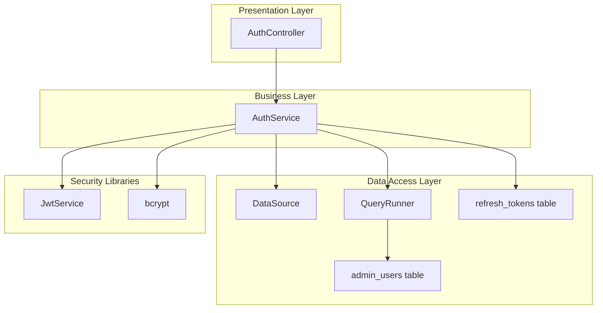
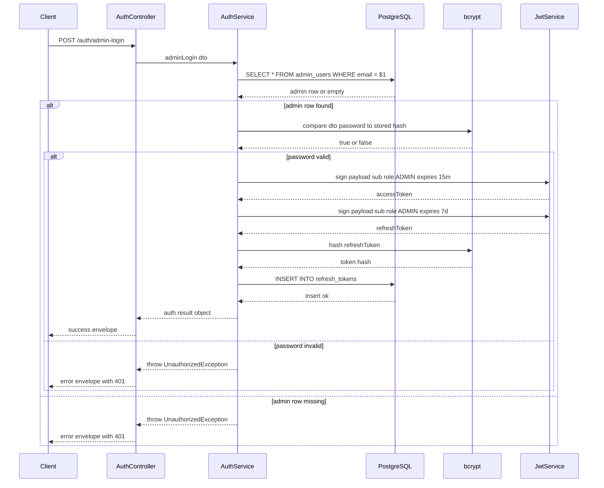
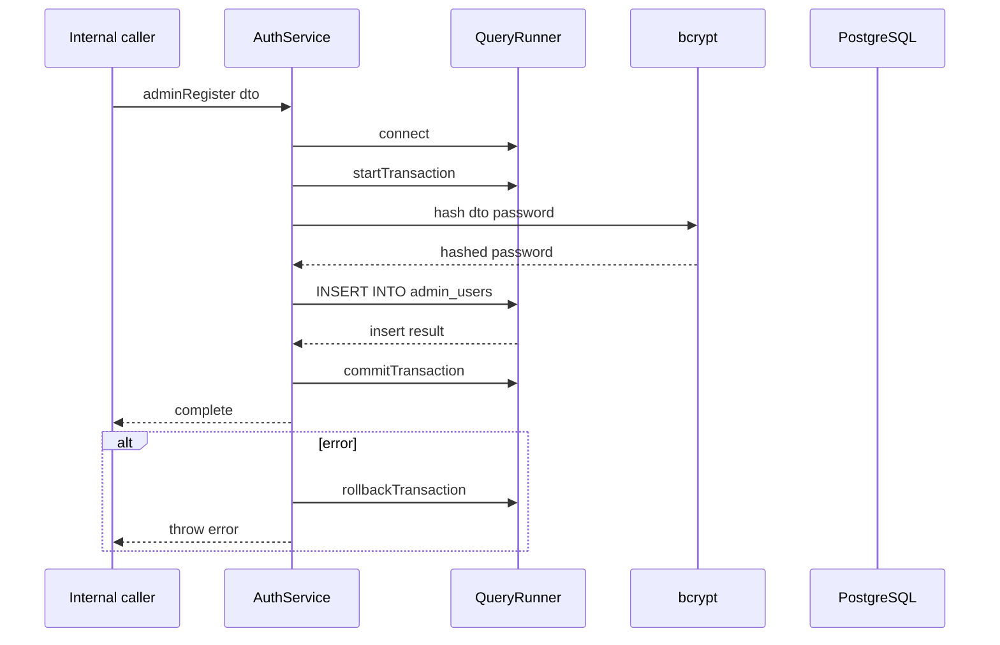

# Authentication DOMAIN - Admin authentication flows and controller response patterns

## Overview

This section covers the admin-specific authentication path implemented in `AuthService` and the controller response behavior in `AuthController`. The admin login flow reads from `admin_users`, validates the password with `bcrypt`, issues JWT access and refresh tokens with an `ADMIN`-scoped payload, and persists the refresh token hash in `refresh_tokens`.

The controller uses mixed response styles across the auth endpoints. `loginAdmin` normalizes success and failure into explicit JSON envelopes, while `register`, `login`, and `getProfile` build success wrappers and rethrow errors, and `refreshToken` and `logout` return a success envelope with the service result spread into it.

## Architecture Overview



## Component Structure

### Auth Controller

AuthService.register() and AuthService.adminRegister() do not return a value in the provided code. The controller success wrapper in register() still assigns data: result, so the serialized payload on that path does not contain a meaningful service result.

*src/auth/auth.controller.ts*

`AuthController` exposes the auth HTTP endpoints and shapes the JSON returned to clients. The admin login handler is the only controller method in this file that converts `UnauthorizedException` into an explicit error envelope instead of rethrowing.

#### Properties

| Property | Type | Description |
| --- | --- | --- |
| `authService` | `AuthService` | Handles authentication work delegated from the controller. |


#### Constructor Dependencies

| Type | Description |
| --- | --- |
| `AuthService` | Service used for registration, login, token rotation, profile lookup, and admin login. |


#### Public Methods

| Method | Description | Returns |
| --- | --- | --- |
| `register` | Calls `AuthService.register()` and wraps the result in a success envelope. | Success envelope object |
| `login` | Calls `AuthService.login()` and wraps the result in a success envelope. | Success envelope object |
| `refreshToken` | Calls `AuthService.refreshToken()` and returns `status: 'success'` plus the service payload. | Success envelope object |
| `logout` | Calls `AuthService.logout()` and returns `status: 'success'` plus the service payload. | Success envelope object |
| `getProfile` | Calls `AuthService.getProfile()` for a `userId` path parameter and wraps the result. | Success envelope object |
| `loginAdmin` | Calls `AuthService.adminLogin()` and returns a custom success or error envelope depending on the failure type. | Success or error envelope object |


### Auth Service

*src/auth/auth.service.ts*

`AuthService` contains the raw SQL and JWT logic for the auth domain. Admin login is implemented here through direct lookup in `admin_users`, token issuance with an `ADMIN` payload, and hashed refresh-token persistence in `refresh_tokens`.

#### Properties

| Property | Type | Description |
| --- | --- | --- |
| `dataSource` | `DataSource` | Executes raw SQL and creates transactional `QueryRunner` instances. |
| `jwtService` | `JwtService` | Signs and decodes JWTs for access and refresh token flows. |


#### Constructor Dependencies

| Type | Description |
| --- | --- |
| `DataSource` | TypeORM connection used for raw SQL queries and transactions. |
| `JwtService` | JWT signing service used for token generation. |


#### Public Methods

| Method | Description | Returns |
| --- | --- | --- |
| `register` | Hashes the password, generates user identifiers, inserts into `users`, then inserts a wallet row in a transaction. | `Promise<void>` |
| `login` | Looks up a user by email, checks the password hash, signs access and refresh tokens, and stores the hashed refresh token. | `Promise<{ accessToken: string; refreshToken: string; user: { id: number; username: string } }>` |
| `refreshToken` | Decodes a refresh token, checks the stored hashes for the user, and issues a new access token. | `Promise<{ accessToken: string }>` |
| `logout` | Decodes the refresh token and revokes all refresh tokens for the decoded user id. | `Promise<{ message: string }>` |
| `getProfile` | Fetches a profile projection from `users` by `userId`. | `Promise<any>` |
| `adminLogin` | Looks up an admin user by email, validates the password, signs `ADMIN` JWTs, and stores the hashed refresh token. | `Promise<{ accessToken: string; refreshToken: string; admin: { id: number; email: string } }>` |
| `adminRegister` | Hashes an admin password and inserts an `ADMIN` row into `admin_users` inside a transaction. | `Promise<void>` |


#### Database Touch Points

| Table | Operation | Purpose |
| --- | --- | --- |
| `admin_users` | `SELECT` by `email`, `INSERT` with `role = 'ADMIN'` | Admin identity lookup and transactional provisioning. |
| `refresh_tokens` | `INSERT` hashed token, `SELECT` non-revoked tokens, `UPDATE` revoke flags | Refresh-token persistence and logout revocation. |


## Admin Authentication Flow

### Admin Login

adminRegister() is an internal service helper only. The AuthController shown here does not expose a route that calls it.

`loginAdmin()` is the admin-only auth path in `AuthService`. It reads the admin account from `admin_users`, compares the password with `bcrypt.compare`, signs JWTs with a payload that includes `role: 'ADMIN'`, and stores a bcrypt hash of the refresh token in `refresh_tokens`.



### Internal Admin Registration Helper

`adminRegister()` performs a transactional insert into `admin_users`. It opens a `QueryRunner`, starts a transaction, hashes the password with 10 salt rounds, writes the row with `role = 'ADMIN'`, and commits on success or rolls back on failure.



## Controller Response Patterns

`AuthController` does not use one uniform envelope shape. The response keys and error strategy differ by handler, and the admin login path is the only one that converts `UnauthorizedException` into a structured error response instead of rethrowing.

| Method | Success Envelope | Error Handling |
| --- | --- | --- |
| `register` | `status: 'success'`, `Code: 201`, `message`, `data` | Logs and rethrows errors |
| `login` | `status: 'success'`, `Code: 200`, `message`, `data` | Logs and rethrows errors |
| `refreshToken` | `status: 'success'` plus the service result spread into the object | No local catch block |
| `logout` | `status: 'success'` plus the service result spread into the object | No local catch block |
| `getProfile` | `status: 'success'`, `Code: 200`, `message`, `data` | Logs and rethrows errors |
| `loginAdmin` | `status: 'success'`, `code: 200`, `message`, `data` | `UnauthorizedException` returns `status: 'error'`, `code: 401`; other errors return `status: 'error'`, `code: 500` |


## API Integration

### Admin Login

#### Admin Login

```api
{
    "title": "Admin Login",
    "description": "Authenticates an admin user from admin_users, issues ADMIN-scoped JWTs, and persists the refresh token hash",
    "method": "POST",
    "baseUrl": "<AuthApiBaseUrl>",
    "endpoint": "/auth/admin-login",
    "headers": [
        {
            "key": "Content-Type",
            "value": "application/json",
            "required": true
        }
    ],
    "queryParams": [],
    "pathParams": [],
    "bodyType": "json",
    "requestBody": "{\n    \"email\": \"admin@example.com\",\n    \"password\": \"AdminP@ssw0rd123\"\n}",
    "formData": [],
    "rawBody": "",
    "responses": {
        "200": {
            "description": "Admin login success",
            "body": "{\n    \"status\": \"success\",\n    \"code\": 200,\n    \"message\": \"Admin logged in successfully\",\n    \"data\": {\n        \"accessToken\": \"eyJhbGciOiJIUzI1NiIsInR5cCI6IkpXVCJ9.admin-access-token\",\n        \"refreshToken\": \"eyJhbGciOiJIUzI1NiIsInR5cCI6IkpXVCJ9.admin-refresh-token\",\n        \"admin\": {\n            \"id\": 42,\n            \"email\": \"admin@example.com\"\n        }\n    }\n}"
        },
        "401": {
            "description": "Admin not found or invalid password",
            "body": "{\n    \"status\": \"error\",\n    \"code\": 401,\n    \"message\": \"Admin not found\"\n}"
        },
        "500": {
            "description": "Unexpected admin login failure",
            "body": "{\n    \"status\": \"error\",\n    \"code\": 500,\n    \"message\": \"Internal server error\"\n}"
        }
    }
}
```

### Register User

#### Register User

```api
{
    "title": "Register User",
    "description": "Creates a user record and wallet row through AuthService.register and returns a success envelope from the controller",
    "method": "POST",
    "baseUrl": "<AuthApiBaseUrl>",
    "endpoint": "/auth/register",
    "headers": [
        {
            "key": "Content-Type",
            "value": "application/json",
            "required": true
        }
    ],
    "queryParams": [],
    "pathParams": [],
    "bodyType": "json",
    "requestBody": "{\n    \"full_name\": \"Jane Doe\",\n    \"email\": \"jane.doe@example.com\",\n    \"password\": \"P@ssw0rd123!\"\n}",
    "formData": [],
    "rawBody": "",
    "responses": {
        "201": {
            "description": "User registration success",
            "body": "{\n    \"status\": \"success\",\n    \"Code\": 201,\n    \"message\": \"User registered successfully\"\n}"
        }
    }
}
```

### Login User

#### Login User

```api
{
    "title": "Login User",
    "description": "Authenticates a user by email and password, then returns access and refresh tokens plus the basic user identity",
    "method": "POST",
    "baseUrl": "<AuthApiBaseUrl>",
    "endpoint": "/auth/login",
    "headers": [
        {
            "key": "Content-Type",
            "value": "application/json",
            "required": true
        }
    ],
    "queryParams": [],
    "pathParams": [],
    "bodyType": "json",
    "requestBody": "{\n    \"email\": \"jane.doe@example.com\",\n    \"password\": \"P@ssw0rd123!\"\n}",
    "formData": [],
    "rawBody": "",
    "responses": {
        "200": {
            "description": "Login success",
            "body": "{\n    \"status\": \"success\",\n    \"Code\": 200,\n    \"message\": \"User logged in successfully\",\n    \"data\": {\n        \"accessToken\": \"eyJhbGciOiJIUzI1NiIsInR5cCI6IkpXVCJ9.user-access-token\",\n        \"refreshToken\": \"eyJhbGciOiJIUzI1NiIsInR5cCI6IkpXVCJ9.user-refresh-token\",\n        \"user\": {\n            \"id\": 17,\n            \"username\": \"jdjoe123\"\n        }\n    }\n}"
        }
    }
}
```

### Refresh Token

#### Refresh Token

```api
{
    "title": "Refresh Token",
    "description": "Validates a stored refresh token and returns a new access token",
    "method": "POST",
    "baseUrl": "<AuthApiBaseUrl>",
    "endpoint": "/auth/refresh-token",
    "headers": [
        {
            "key": "Content-Type",
            "value": "application/json",
            "required": true
        }
    ],
    "queryParams": [],
    "pathParams": [],
    "bodyType": "json",
    "requestBody": "{\n    \"refreshToken\": \"eyJhbGciOiJIUzI1NiIsInR5cCI6IkpXVCJ9.user-refresh-token\"\n}",
    "formData": [],
    "rawBody": "",
    "responses": {
        "200": {
            "description": "Token refreshed successfully",
            "body": "{\n    \"status\": \"success\",\n    \"accessToken\": \"eyJhbGciOiJIUzI1NiIsInR5cCI6IkpXVCJ9.new-access-token\"\n}"
        }
    }
}
```

### Logout

#### Logout

```api
{
    "title": "Logout",
    "description": "Marks all refresh tokens for the decoded user id as revoked",
    "method": "POST",
    "baseUrl": "<AuthApiBaseUrl>",
    "endpoint": "/auth/logout",
    "headers": [
        {
            "key": "Content-Type",
            "value": "application/json",
            "required": true
        }
    ],
    "queryParams": [],
    "pathParams": [],
    "bodyType": "json",
    "requestBody": "{\n    \"refreshToken\": \"eyJhbGciOiJIUzI1NiIsInR5cCI6IkpXVCJ9.user-refresh-token\"\n}",
    "formData": [],
    "rawBody": "",
    "responses": {
        "200": {
            "description": "Logout success",
            "body": "{\n    \"status\": \"success\",\n    \"message\": \"Logged out successfully\"\n}"
        }
    }
}
```

### Get Profile

#### Get Profile

```api
{
    "title": "Get Profile",
    "description": "Fetches a user profile projection by userId and returns the profile fields selected in AuthService.getProfile",
    "method": "GET",
    "baseUrl": "<AuthApiBaseUrl>",
    "endpoint": "/auth/profile/{userId}",
    "headers": [],
    "queryParams": [],
    "pathParams": [
        {
            "name": "userId",
            "type": "string",
            "required": true
        }
    ],
    "bodyType": "none",
    "requestBody": "",
    "formData": [],
    "rawBody": "",
    "responses": {
        "200": {
            "description": "Profile retrieved successfully",
            "body": "{\n    \"status\": \"success\",\n    \"Code\": 200,\n    \"message\": \"User profile retrieved successfully\",\n    \"data\": {\n        \"full_name\": \"Jane Doe\",\n        \"email\": \"jane.doe@example.com\",\n        \"username\": \"jdjoe123\",\n        \"profile_image_url\": \"https://cdn.example.com/profiles/jane.png\",\n        \"account_status\": \"ACTIVE\",\n        \"user_code\": \"JDJANE7X2Q\",\n        \"referral_code\": \"REF12345\"\n    }\n}"
        }
    }
}
```

## Dependencies

| Dependency | Used In | Purpose |
| --- | --- | --- |
| `DataSource` | `AuthService` | Executes raw SQL and creates transactional query runners. |
| `QueryRunner` | `AuthService.register`, `AuthService.adminRegister` | Groups multi-step inserts into a single transaction. |
| `JwtService` | `AuthService` | Signs and decodes JWTs. |
| `bcrypt` | `AuthService` | Hashes passwords and refresh tokens, and compares password hashes. |
| `UnauthorizedException` | `AuthService`, `AuthController` | Signals auth failures and enables admin-login error envelope branching. |


## Key Classes Reference

The controller mixes Code and code across methods. register, login, and getProfile use uppercase Code, while loginAdmin, refreshToken, and logout use lowercase code or omit it entirely. loginAdmin also returns error envelopes directly, unlike the other handlers that rethrow.

| Class | Responsibility |
| --- | --- |
| `AuthController` | Exposes auth endpoints and shapes controller responses in `auth.controller.ts`. |
| `AuthService` | Implements auth persistence, token generation, refresh-token storage, and admin login in `auth.service.ts`. |
