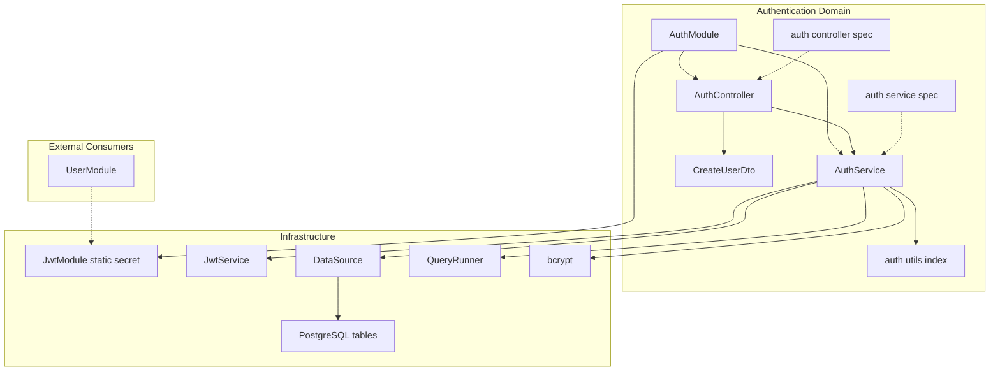
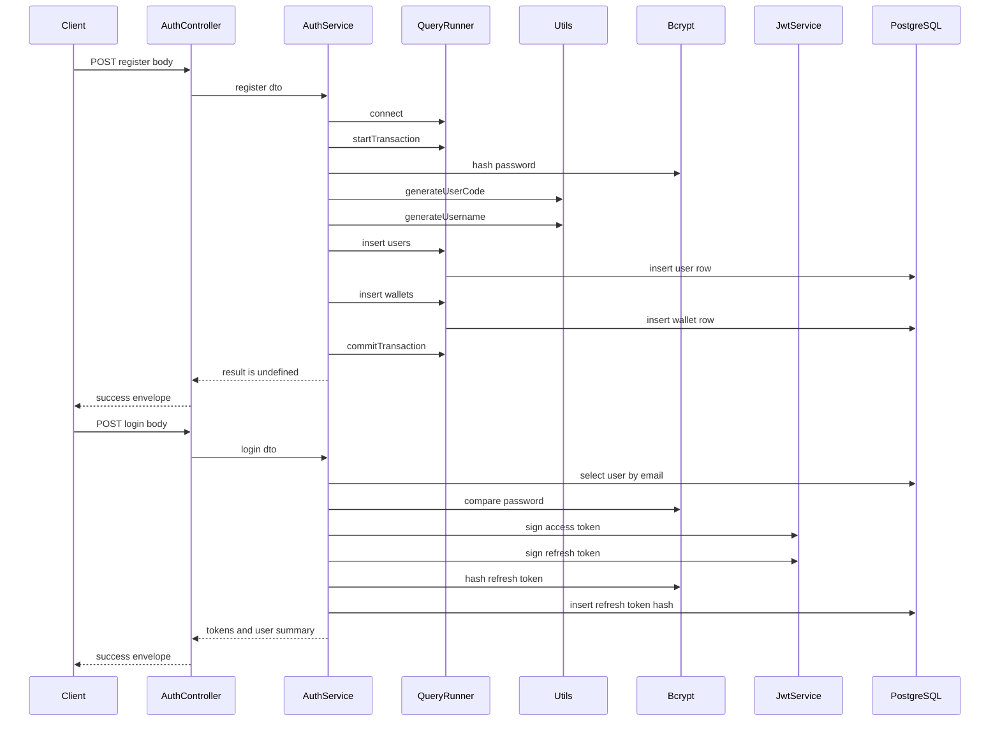
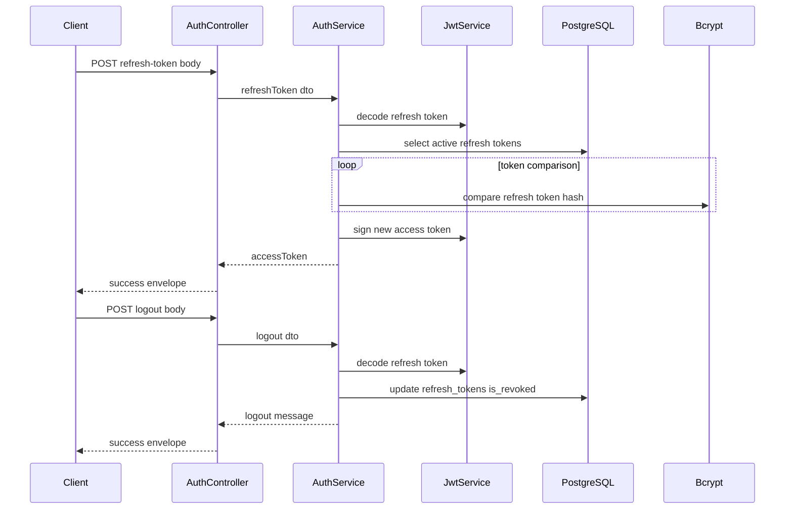
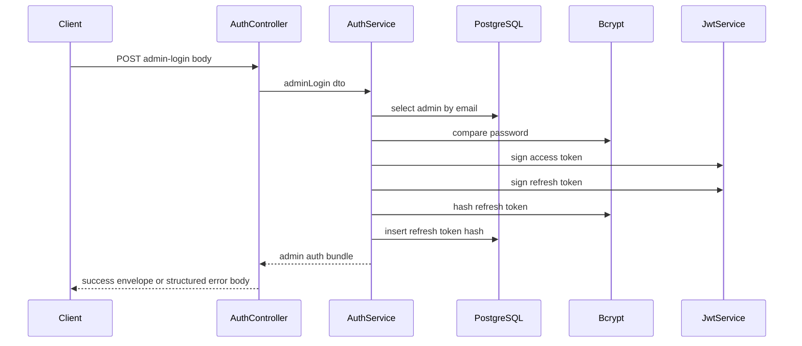

# Authentication Domain — Module Boundaries, Validation Assets, and Test Scaffolding

## Overview

The authentication domain in `win-x88` handles credential-based access for users and admins, issues JWT access and refresh tokens, and exposes profile lookup and logout flows through a single NestJS controller. The service layer talks directly to PostgreSQL through `TypeORM` `DataSource` and `QueryRunner` raw SQL, and it uses `bcrypt` for password and refresh-token hashing.

This domain also defines the JWT module boundary for the rest of the application. `AuthModule` registers `JwtModule` with a hardcoded secret and exports it so other modules can reuse `JwtService` for verification, while `CreateUserDto` and the identifier helpers in  provide the validation and naming assets used by registration logic.

## Architecture Overview



## Component Structure

### Auth Module Boundary

AuthModule registers JwtModule with the literal secret 'your-secret-key'. Every token signed by AuthService and verified by consumers such as JwtAuthGuard depends on that fixed value. In production, this makes secret rotation, environment separation, and secret management dependent on a code change instead of configuration.

*`src/auth/auth.module.ts`*

`AuthModule` defines the auth-domain boundary. It wires the controller and service together, registers `JwtModule` with a static secret, and exports `JwtModule` instead of exporting `AuthService`.

#### Properties

| Property | Type | Description |
| --- | --- | --- |
| `AuthModule` metadata | module metadata | Declares `AuthController`, `AuthService`, `JwtModule`, and the exported `JwtModule` surface. |


#### Constructor Dependencies

| Type | Description |
| --- | --- |
| None | `AuthModule` does not declare a constructor. |


#### Public Methods

| Method | Description |
| --- | --- |
| None | `AuthModule` only supplies module metadata. |


#### Module Wiring

| Metadata | Value |
| --- | --- |
| Imports | `JwtModule.register({ secret: 'your-secret-key' })` |
| Controllers | `AuthController` |
| Providers | `AuthService` |
| Exports | `JwtModule` |


`AuthModule` is the only place in this section where `JwtModule` is configured. Because the module exports `JwtModule`, other modules that import `AuthModule` can resolve `JwtService` without re-registering JWT configuration.

### Auth Controller

*`src/auth/auth.controller.ts`*

`AuthController` exposes the HTTP entry points for registration, login, refresh, logout, profile lookup, and admin login. It forwards every request body or route parameter directly to `AuthService` and formats the response envelope in the controller.

#### Properties

| Property | Type | Description |
| --- | --- | --- |
| `authService` | `AuthService` | Service dependency used to execute all auth operations. |


#### Constructor Dependencies

| Type | Description |
| --- | --- |
| `AuthService` | Executes registration, login, token refresh, logout, profile lookup, and admin login logic. |


#### Public Methods

| Method | Description |
| --- | --- |
| `register` | Calls `AuthService.register` and returns a success envelope for user creation. |
| `login` | Calls `AuthService.login` and returns tokens plus the user summary. |
| `refreshToken` | Calls `AuthService.refreshToken` and returns a new access token. |
| `logout` | Calls `AuthService.logout` and returns the service message. |
| `getProfile` | Calls `AuthService.getProfile` using the `userId` route parameter. |
| `loginAdmin` | Calls `AuthService.adminLogin` and returns an admin auth response or structured error body. |


#### Execution Notes

- `register`, `login`, and `getProfile` wrap the service call in `try/catch`, log failures, and rethrow the error.
- `refreshToken` and `logout` do not wrap the service call in controller-level `try/catch`.
- `loginAdmin` catches `UnauthorizedException` and returns a JSON error body instead of rethrowing.
- None of the shown handlers use `@UseGuards` or a validation pipe.

### Auth Service

*`src/auth/auth.service.ts`*

`AuthService` contains the auth business logic and all PostgreSQL interaction for the auth domain. It hashes credentials, signs JWTs, persists refresh-token hashes, and reads or updates the relevant user and admin tables through raw SQL.

#### Properties

| Property | Type | Description |
| --- | --- | --- |
| `dataSource` | `DataSource` | Used to create `QueryRunner` instances and execute raw SQL queries. |
| `jwtService` | `JwtService` | Used to sign and decode JWT payloads. |


#### Constructor Dependencies

| Type | Description |
| --- | --- |
| `DataSource` | Provides direct SQL execution and transaction control. |
| `JwtService` | Signs access and refresh tokens and decodes refresh tokens for renewal and logout. |


#### Public Methods

| Method | Description |
| --- | --- |
| `register` | Hashes the password, generates user identifiers, inserts a user, creates a wallet, and commits the transaction. |
| `login` | Validates credentials, signs access and refresh tokens, stores the refresh-token hash, and returns the token bundle. |
| `refreshToken` | Decodes the refresh token, verifies it against stored hashes, and returns a new access token. |
| `logout` | Decodes the refresh token and revokes all refresh tokens for the decoded user. |
| `getProfile` | Fetches the selected profile fields for a user ID. |
| `adminLogin` | Validates admin credentials, signs tokens, stores the refresh-token hash, and returns the admin bundle. |
| `adminRegister` | Inserts a new admin user in a transaction. This method is internal to the service and is not exposed by `AuthController`. |


#### Database Tables Touched

| Method | Tables |
| --- | --- |
| `register` | `users`, `wallets` |
| `login` | `users`, `refresh_tokens` |
| `refreshToken` | `refresh_tokens` |
| `logout` | `refresh_tokens` |
| `getProfile` | `users` |
| `adminLogin` | `admin_users`, `refresh_tokens` |
| `adminRegister` | `admin_users` |


#### Transaction and Error Flow

- `register` and `adminRegister` use `queryRunner.connect()`, `startTransaction()`, `commitTransaction()`, and `rollbackTransaction()`.
- `register` hashes `dto.password` with `bcrypt.hash(..., 10)` before insert.
- `login` and `adminLogin` use `bcrypt.compare` against the stored password hash.
- `refreshToken` uses `jwtService.decode(dto.refreshToken)` and compares the provided token against stored `token_hash` values with `bcrypt.compare`.
- `logout` decodes the token and updates `refresh_tokens` with `is_revoked = true`.
- `getProfile` throws `UnauthorizedException('User ID is required')` when `dto.userId` is missing.
- `login`, `refreshToken`, and `adminLogin` throw `UnauthorizedException` for invalid credentials or invalid tokens.

### Validation Assets

AuthService.register() does not return a payload after committing the transaction. AuthController.register() still wraps the call as data: result, so the success response serializes only the wrapper metadata and no service payload.

*`src/auth/dto/user-dto.ts`*

`CreateUserDto` defines the auth-facing validation contract with `class-validator` decorators. It captures the user registration shape, including identity fields, verification flags, referral data, and lifecycle timestamps.

#### Properties

| Property | Type | Validation and Notes |
| --- | --- | --- |
| `user_code` | `string \ | undefined` | `@IsString()`, `@MaxLength(30)` |
| `full_name` | `string` | Optional, `@IsString()`, `@MaxLength(150)` |
| `username` | `string \ | undefined` | `@IsString()`, `@MaxLength(80)` |
| `email` | `string` | Optional, `@IsEmail()`, `@MaxLength(150)` |
| `password` | `string` | `@IsString()` |
| `dob` | `string` | Optional, `@IsDateString()` |
| `profile_image_url` | `string` | Optional, `@IsString()` |
| `is_email_verified` | `boolean` | Optional, `@IsBoolean()`, default `false` |
| `referral_code` | `string` | `@IsString()`, `@MaxLength(30)` |
| `referred_by_user_id` | `number` | Optional, `@IsNumber()` |
| `vip_level` | `number` | Optional, `@IsNumber()`, `@Min(0)`, default `0` |
| `account_status` | `string` | Optional, `@IsString()`, `@IsIn(['ACTIVE', 'BLOCKED', 'SUSPENDED'])`, default `ACTIVE` |
| `last_login_at` | `string` | Optional, `@IsDateString()` |
| `created_at` | `string` | Optional, `@IsDateString()` |
| `updated_at` | `string` | Optional, `@IsDateString()` |


#### Constructor Dependencies

| Type | Description |
| --- | --- |
| None | `CreateUserDto` is a plain class with decorators. |


#### Public Methods

| Method | Description |
| --- | --- |
| None | The class is a data contract only. |


### Identifier Generation Utilities

CreateUserDto defines validation rules, but the shown auth handlers accept any bodies instead of CreateUserDto. The DTO exists as a validation asset, but the controller methods shown here do not reference it directly.

*`src/auth/utils/index.ts`*

The auth utilities generate human-readable registration identifiers from a user’s name and email. `AuthService.register()` uses both helpers before inserting the new user record.

#### Properties

| Property | Type | Description |
| --- | --- | --- |
| None | N/A | The file exports functions only. |


#### Constructor Dependencies

| Type | Description |
| --- | --- |
| None | The file exports standalone helpers. |


#### Public Methods

| Method | Description |
| --- | --- |
| `generateUsername` | Builds a lowercase username from initials, the first three characters of the email local part, and a random three-digit number. |
| `generateUserCode` | Builds an uppercase user code from initials, the first three characters of the email local part, and a random four-character alphanumeric suffix. |


#### Function Behavior

| Method | Output Shape | Used By |
| --- | --- | --- |
| `generateUsername` | Lowercase, concatenated identifier such as `jdjo123` | `AuthService.register` |
| `generateUserCode` | Uppercase, concatenated identifier such as `JDJOH1A2B` | `AuthService.register` |


### Test Scaffolding

#### Auth Controller Spec

*`src/auth/auth.controller.spec.ts`*

This spec only proves that the controller class can be retrieved from a Nest testing module. It does not exercise any controller method or assert any response shape.

| File | Setup | Assertion | Behavioral Coverage |
| --- | --- | --- | --- |
| `auth.controller.spec.ts` | `Test.createTestingModule({ controllers: [AuthController] })` | `expect(controller).toBeDefined()` | None |


#### Auth Service Spec

*`src/auth/auth.service.spec.ts`*

This spec only proves that the service class can be retrieved from a Nest testing module. It does not mock the database, JWT service, or bcrypt, and it does not invoke any service method.

| File | Setup | Assertion | Behavioral Coverage |
| --- | --- | --- | --- |
| `auth.service.spec.ts` | `Test.createTestingModule({ providers: [AuthService] })` | `expect(service).toBeDefined()` | None |


## Feature Flows

### Registration and Login Flow



### Refresh and Logout Flow



### Admin Login Flow



## API Integration

### Register User

#### Register User

```api
{
    "title": "Register User",
    "description": "Creates a new user record, generates auth identifiers, and creates the initial wallet entry",
    "method": "POST",
    "baseUrl": "<AuthApiBaseUrl>",
    "endpoint": "/auth/register",
    "headers": [
        {
            "key": "Content-Type",
            "value": "application/json",
            "required": true
        }
    ],
    "queryParams": [],
    "pathParams": [],
    "bodyType": "json",
    "requestBody": "{\n    \"full_name\": \"Jane Doe\",\n    \"email\": \"jane.doe@example.com\",\n    \"password\": \"P@ssw0rd123\"\n}",
    "formData": [],
    "rawBody": "",
    "responses": {
        "201": {
            "description": "Success",
            "body": "{\n    \"status\": \"success\",\n    \"Code\": 201,\n    \"message\": \"User registered successfully\"\n}"
        }
    }
}
```

### Login User

#### Login User

```api
{
    "title": "Login User",
    "description": "Validates a user password, issues access and refresh tokens, and stores the refresh-token hash",
    "method": "POST",
    "baseUrl": "<AuthApiBaseUrl>",
    "endpoint": "/auth/login",
    "headers": [
        {
            "key": "Content-Type",
            "value": "application/json",
            "required": true
        }
    ],
    "queryParams": [],
    "pathParams": [],
    "bodyType": "json",
    "requestBody": "{\n    \"email\": \"jane.doe@example.com\",\n    \"password\": \"P@ssw0rd123\"\n}",
    "formData": [],
    "rawBody": "",
    "responses": {
        "201": {
            "description": "Success",
            "body": "{\n    \"status\": \"success\",\n    \"Code\": 200,\n    \"message\": \"User logged in successfully\",\n    \"data\": {\n        \"accessToken\": \"eyJhbGciOiJIUzI1NiIsInR5cCI6IkpXVCJ9.example.access\",\n        \"refreshToken\": \"eyJhbGciOiJIUzI1NiIsInR5cCI6IkpXVCJ9.example.refresh\",\n        \"user\": {\n            \"id\": 42,\n            \"username\": \"jdjoe123\"\n        }\n    }\n}"
        }
    }
}
```

### Refresh Token

#### Refresh Token

```api
{
    "title": "Refresh Token",
    "description": "Decodes a refresh token, checks it against stored hashes, and returns a new access token",
    "method": "POST",
    "baseUrl": "<AuthApiBaseUrl>",
    "endpoint": "/auth/refresh-token",
    "headers": [
        {
            "key": "Content-Type",
            "value": "application/json",
            "required": true
        }
    ],
    "queryParams": [],
    "pathParams": [],
    "bodyType": "json",
    "requestBody": "{\n    \"refreshToken\": \"eyJhbGciOiJIUzI1NiIsInR5cCI6IkpXVCJ9.example.refresh\"\n}",
    "formData": [],
    "rawBody": "",
    "responses": {
        "201": {
            "description": "Success",
            "body": "{\n    \"status\": \"success\",\n    \"accessToken\": \"eyJhbGciOiJIUzI1NiIsInR5cCI6IkpXVCJ9.example.newaccess\"\n}"
        }
    }
}
```

### Logout

#### Logout

```api
{
    "title": "Logout",
    "description": "Decodes a refresh token and marks all refresh tokens for the decoded user as revoked",
    "method": "POST",
    "baseUrl": "<AuthApiBaseUrl>",
    "endpoint": "/auth/logout",
    "headers": [
        {
            "key": "Content-Type",
            "value": "application/json",
            "required": true
        }
    ],
    "queryParams": [],
    "pathParams": [],
    "bodyType": "json",
    "requestBody": "{\n    \"refreshToken\": \"eyJhbGciOiJIUzI1NiIsInR5cCI6IkpXVCJ9.example.refresh\"\n}",
    "formData": [],
    "rawBody": "",
    "responses": {
        "201": {
            "description": "Success",
            "body": "{\n    \"status\": \"success\",\n    \"message\": \"Logged out successfully\"\n}"
        }
    }
}
```

### Get Profile

#### Get Profile

```api
{
    "title": "Get Profile",
    "description": "Fetches a user profile by userId without an auth guard in the shown controller",
    "method": "GET",
    "baseUrl": "<AuthApiBaseUrl>",
    "endpoint": "/auth/profile/:userId",
    "headers": [],
    "queryParams": [],
    "pathParams": [
        {
            "key": "userId",
            "value": "42",
            "required": true
        }
    ],
    "bodyType": "none",
    "requestBody": "",
    "formData": [],
    "rawBody": "",
    "responses": {
        "200": {
            "description": "Success",
            "body": "{\n    \"status\": \"success\",\n    \"Code\": 200,\n    \"message\": \"User profile retrieved successfully\",\n    \"data\": {\n        \"full_name\": \"Jane Doe\",\n        \"email\": \"jane.doe@example.com\",\n        \"username\": \"jdjoe123\",\n        \"profile_image_url\": \"https://cdn.example.com/profile/jane.png\",\n        \"account_status\": \"ACTIVE\",\n        \"user_code\": \"JDOJH1A2B\",\n        \"referral_code\": \"REF123456789\"\n    }\n}"
        }
    }
}
```

### Admin Login

#### Admin Login

```api
{
    "title": "Admin Login",
    "description": "Validates an admin account, issues access and refresh tokens, and persists the refresh-token hash",
    "method": "POST",
    "baseUrl": "<AuthApiBaseUrl>",
    "endpoint": "/auth/admin-login",
    "headers": [
        {
            "key": "Content-Type",
            "value": "application/json",
            "required": true
        }
    ],
    "queryParams": [],
    "pathParams": [],
    "bodyType": "json",
    "requestBody": "{\n    \"email\": \"admin@example.com\",\n    \"password\": \"Adm1nP@ss123\"\n}",
    "formData": [],
    "rawBody": "",
    "responses": {
        "201": {
            "description": "Success",
            "body": "{\n    \"status\": \"success\",\n    \"code\": 200,\n    \"message\": \"Admin logged in successfully\",\n    \"data\": {\n        \"accessToken\": \"eyJhbGciOiJIUzI1NiIsInR5cCI6IkpXVCJ9.example.adminaccess\",\n        \"refreshToken\": \"eyJhbGciOiJIUzI1NiIsInR5cCI6IkpXVCJ9.example.adminrefresh\",\n        \"admin\": {\n            \"id\": 7,\n            \"email\": \"admin@example.com\"\n        }\n    }\n}"
        },
        "401": {
            "description": "Unauthorized",
            "body": "{\n    \"status\": \"error\",\n    \"code\": 401,\n    \"message\": \"Admin not found\"\n}"
        }
    }
}
```

## Error Handling

The controller response envelope is not consistent across auth routes. register, login, and getProfile use Code, while loginAdmin uses code. refreshToken and logout spread service results directly and do not include either field.

`AuthService` throws `UnauthorizedException` for invalid user credentials, invalid refresh tokens, and missing user IDs. `AuthController.loginAdmin` translates `UnauthorizedException` into a structured JSON error body instead of rethrowing it, while `register`, `login`, and `getProfile` log and rethrow controller-level errors.

`register` and `adminRegister` roll back the transaction on any error after `startTransaction()`. `refreshToken` explicitly rejects invalid token decoding and invalid refresh-token hashes, while `logout` assumes `jwtService.decode(dto.refreshToken)` returns an object and uses `decoded.sub` directly.

## Dependencies

### Auth Domain Dependencies

| Dependency | Role in This Domain |
| --- | --- |
| `@nestjs/common` | Controllers, decorators, and `UnauthorizedException` handling. |
| `@nestjs/jwt` | `JwtModule` registration and `JwtService` token operations. |
| `typeorm` | `DataSource` and `QueryRunner` for raw SQL and transaction control. |
| `bcrypt` | Password hashing, password comparison, and refresh-token hashing. |
| `class-validator` | Validation decorators on `CreateUserDto`. |


### Storage Dependencies

| Table | Usage |
| --- | --- |
| `users` | User registration, login lookup, profile retrieval. |
| `wallets` | Wallet creation during registration. |
| `refresh_tokens` | Refresh-token persistence, validation, and revocation. |
| `admin_users` | Admin authentication and admin registration. |


### Internal Domain Dependencies

| File | Role |
| --- | --- |
|  | Generates `user_code` and `username` for registration. |
|  | Defines the registration validation contract. |
|  | Publishes the JWT provider boundary for the application. |


## Testing Considerations

The current unit test files are scaffolding-only:

- `auth.controller.spec.ts` only checks that `AuthController` is defined.
- `auth.service.spec.ts` only checks that `AuthService` is defined.
- Neither spec exercises any route handler, transaction, token-signing path, password comparison, or SQL behavior.
- No test in the shown auth section verifies the generated username or user code helpers.

### Auth Scenarios Not Covered by the Shown Specs

| Scenario | Code Path |
| --- | --- |
| Register success and rollback | `AuthService.register` |
| User login success and invalid password | `AuthService.login` |
| Refresh token acceptance and rejection | `AuthService.refreshToken` |
| Logout revocation | `AuthService.logout` |
| Profile lookup by user ID | `AuthService.getProfile` |
| Admin login success and unauthorized branches | `AuthService.adminLogin` and `AuthController.loginAdmin` |


## Key Classes Reference

| Class | Responsibility |
| --- | --- |
| `auth.module.ts` | Declares the auth module boundary, registers `JwtModule`, and exports it. |
| `auth.controller.ts` | Exposes auth HTTP endpoints and formats controller-level responses. |
| `auth.service.ts` | Implements auth business logic, token handling, and raw SQL persistence. |
|  | Defines the auth registration validation contract. |
|  | Generates usernames and user codes for new users. |
| `auth.controller.spec.ts` | Provides definition-level controller test scaffolding. |
| `auth.service.spec.ts` | Provides definition-level service test scaffolding. |
