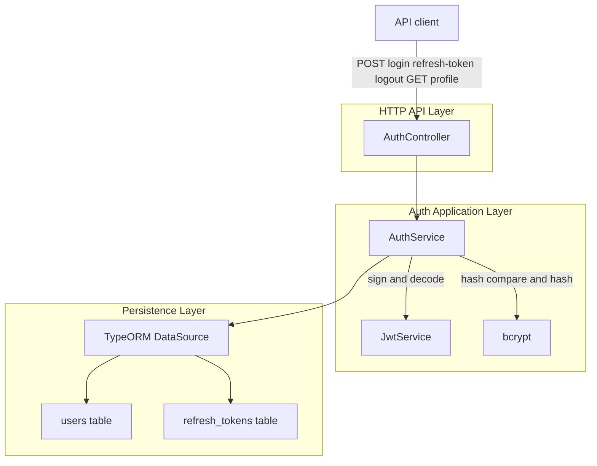
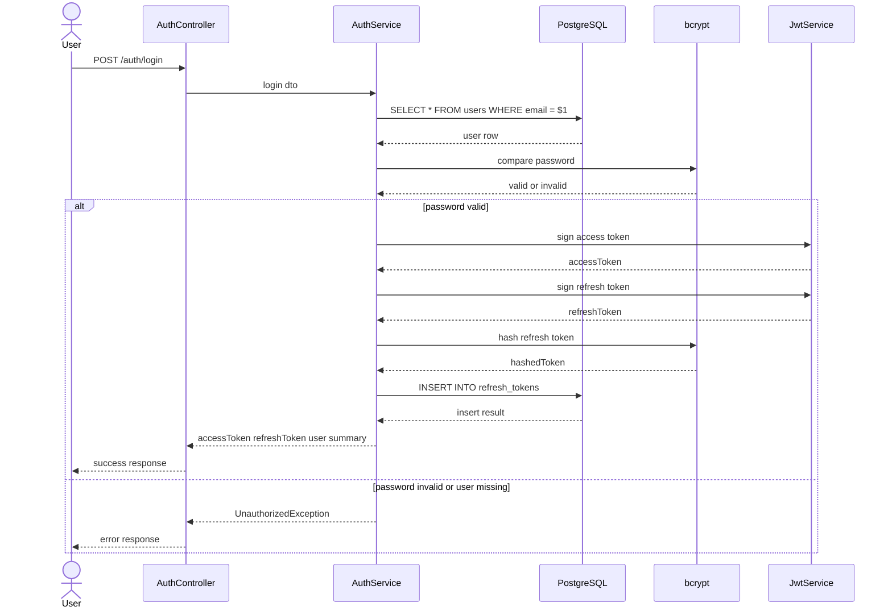
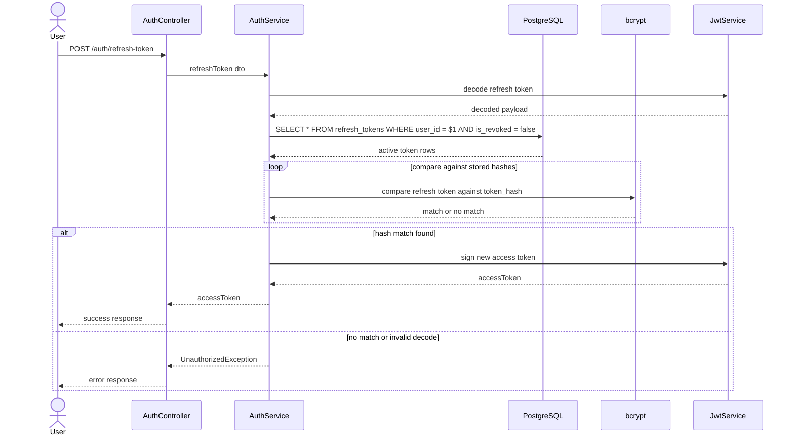
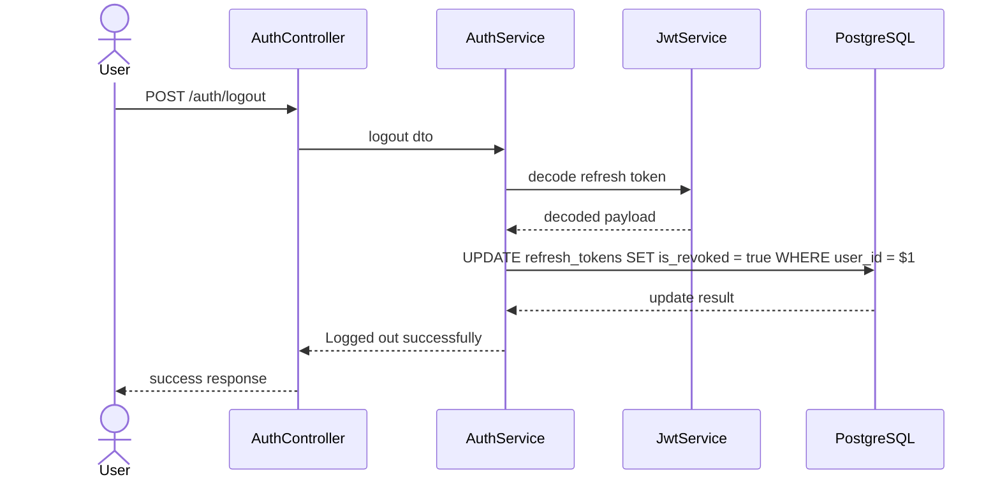
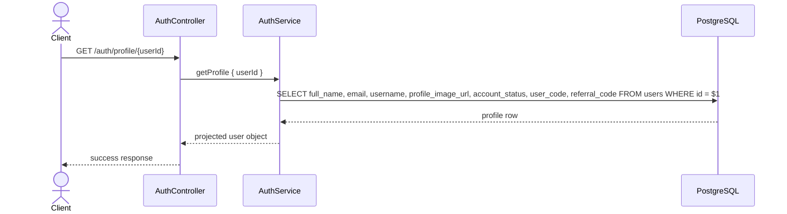
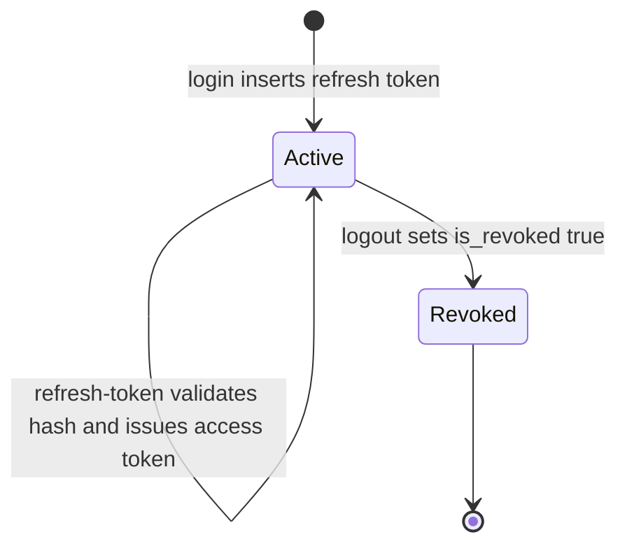

# Authentication Domain - User Login, Refresh Token Rotation, Logout, and Profile Lookup

*`src/auth/auth.controller.ts`*

*`src/auth/auth.service.ts`*

## Overview

This feature handles the user-facing authentication session lifecycle in `AuthController` and `AuthService`: login with email and password, refresh-token validation against persisted hashes, logout with session revocation, and profile lookup by user ID. The login flow issues a short-lived access token and a long-lived refresh token, then stores only a bcrypt hash of the refresh token in PostgreSQL.

The same service also serves the profile lookup endpoint that projects a limited set of user fields from `users`. The implementation uses raw SQL through `DataSource.query`, JWT signing and decoding through `JwtService`, and bcrypt for password and refresh-token verification.

## Architecture Overview



## Component Structure

### Auth Controller

*`src/auth/auth.controller.ts`*

`AuthController` exposes the HTTP endpoints for login, refresh, logout, and profile lookup. The controller wraps successful responses in a small envelope and logs thrown errors before rethrowing them for NestJS exception handling.

#### Properties

| Property | Type | Description |
| --- | --- | --- |
| `authService` | `AuthService` | Delegates all authentication and profile operations to the service layer. |


#### Constructor Dependencies

| Type | Description |
| --- | --- |
| `AuthService` | Handles login, refresh-token validation, logout revocation, and profile lookup. |


#### Public Methods

| Method | Description |
| --- | --- |
| `login` | Authenticates a user with email and password, then returns access and refresh tokens. |
| `refreshToken` | Validates a refresh token against stored hashes and returns a new access token. |
| `logout` | Revokes all refresh tokens for the decoded user ID. |
| `getProfile` | Returns the projected profile for the requested `userId`. |


### Auth Service

*`src/auth/auth.service.ts`*

`AuthService` performs the SQL reads and writes behind the authentication domain. It validates passwords with bcrypt, signs JWTs, persists refresh-token hashes, validates refresh-token presentation against the database, revokes refresh-token rows, and queries user profile projections.

#### Properties

| Property | Type | Description |
| --- | --- | --- |
| `dataSource` | `DataSource` | Executes raw SQL against PostgreSQL and creates query runners where needed. |
| `jwtService` | `JwtService` | Signs and decodes access tokens and refresh tokens. |


#### Constructor Dependencies

| Type | Description |
| --- | --- |
| `DataSource` | Used for raw SQL reads and writes against `users` and `refresh_tokens`. |
| `JwtService` | Used for JWT signing and decoding in the login, refresh, and logout flows. |


#### Public Methods

| Method | Description |
| --- | --- |
| `login` | Looks up a user by email, validates the password, issues tokens, and persists the refresh-token hash. |
| `refreshToken` | Decodes the supplied refresh token, checks its bcrypt hash against active DB rows, and issues a new access token. |
| `logout` | Decodes the supplied refresh token and revokes every refresh token row for that user. |
| `getProfile` | Fetches a limited user projection from `users` and returns the first row. |


## API Endpoints

### Login

#### User Login

```api
{
    "title": "User Login",
    "description": "Authenticates a user by email and password, issues a 15 minute access token and a 7 day refresh token, and stores a bcrypt hash of the refresh token in refresh_tokens.",
    "method": "POST",
    "baseUrl": "<AuthApiBaseUrl>",
    "endpoint": "/auth/login",
    "headers": [
        {
            "key": "Content-Type",
            "value": "application/json",
            "required": true
        }
    ],
    "queryParams": [],
    "pathParams": [],
    "bodyType": "json",
    "requestBody": "{\n    \"email\": \"user@example.com\",\n    \"password\": \"P@ssw0rd123\"\n}",
    "formData": [],
    "rawBody": "",
    "responses": {
        "200": {
            "description": "User logged in successfully",
            "body": "{\n    \"status\": \"success\",\n    \"Code\": 200,\n    \"message\": \"User logged in successfully\",\n    \"data\": {\n        \"accessToken\": \"eyJhbGciOiJIUzI1NiIsInR5cCI6...\",\n        \"refreshToken\": \"eyJhbGciOiJIUzI1NiIsInR5cCI6...\",\n        \"user\": {\n            \"id\": 12,\n            \"username\": \"jdjo123\"\n        }\n    }\n}"
        },
        "401": {
            "description": "Authentication failure raised by UnauthorizedException",
            "body": "{\n    \"statusCode\": 401,\n    \"message\": \"Invalid password\",\n    \"error\": \"Unauthorized\"\n}"
        }
    }
}
```

`AuthService.login` performs these steps:

- Reads the user row with `SELECT * FROM users WHERE email = $1`.
- Rejects the request with `UnauthorizedException('User not found')` if no row exists.
- Validates the submitted password with `bcrypt.compare(dto.password, u.password)`.
- Signs an access token with `expiresIn: '15m'`.
- Signs a refresh token with `expiresIn: '7d'`.
- Hashes the refresh token with `bcrypt.hash(refreshToken, 10)`.
- Inserts the hash into `refresh_tokens` with `expires_at = NOW() + INTERVAL '7 days'`.
- Returns `accessToken`, `refreshToken`, and a limited `user` object containing `id` and `username`.

### Refresh Access Token

#### Refresh Access Token

```api
{
    "title": "Refresh Access Token",
    "description": "Decodes the presented refresh token, validates it against non-revoked bcrypt hashes stored in refresh_tokens, and returns a new access token.",
    "method": "POST",
    "baseUrl": "<AuthApiBaseUrl>",
    "endpoint": "/auth/refresh-token",
    "headers": [
        {
            "key": "Content-Type",
            "value": "application/json",
            "required": true
        }
    ],
    "queryParams": [],
    "pathParams": [],
    "bodyType": "json",
    "requestBody": "{\n    \"refreshToken\": \"eyJhbGciOiJIUzI1NiIsInR5cCI6...\"\n}",
    "formData": [],
    "rawBody": "",
    "responses": {
        "200": {
            "description": "Access token issued after refresh-token validation",
            "body": "{\n    \"status\": \"success\",\n    \"accessToken\": \"eyJhbGciOiJIUzI1NiIsInR5cCI6...\"\n}"
        },
        "401": {
            "description": "Invalid token or invalid refresh token",
            "body": "{\n    \"statusCode\": 401,\n    \"message\": \"Invalid refresh token\",\n    \"error\": \"Unauthorized\"\n}"
        }
    }
}
```

login signs access tokens with { sub, role: 'USER' }, but refreshToken signs the replacement access token with { sub } only. The refreshed access token therefore omits role.

`AuthService.refreshToken` uses a decode-and-compare model:

- `jwtService.decode(dto.refreshToken)` extracts the token payload without signature verification.
- `decoded.sub` is used as the user ID.
- Active rows are loaded with `SELECT * FROM refresh_tokens WHERE user_id = $1 AND is_revoked = false`.
- Each stored `token_hash` is checked with `bcrypt.compare(dto.refreshToken, t.token_hash)`.
- If one hash matches, the method signs a new access token with `expiresIn: '15m'`.
- No new refresh token is minted in this path.

### Logout

#### Logout

```api
{
    "title": "Logout",
    "description": "Decodes the presented refresh token and revokes all refresh_tokens rows for the decoded user ID.",
    "method": "POST",
    "baseUrl": "<AuthApiBaseUrl>",
    "endpoint": "/auth/logout",
    "headers": [
        {
            "key": "Content-Type",
            "value": "application/json",
            "required": true
        }
    ],
    "queryParams": [],
    "pathParams": [],
    "bodyType": "json",
    "requestBody": "{\n    \"refreshToken\": \"eyJhbGciOiJIUzI1NiIsInR5cCI6...\"\n}",
    "formData": [],
    "rawBody": "",
    "responses": {
        "200": {
            "description": "Refresh tokens revoked for the user",
            "body": "{\n    \"status\": \"success\",\n    \"message\": \"Logged out successfully\"\n}"
        }
    }
}
```

The refresh-token validator does not read expires_at; validity is determined only by is_revoked = false and a bcrypt hash match. [!NOTE] POST /auth/refresh-token is a reissue flow, not a full rotation flow. The method returns a new access token only and keeps the existing refresh token unchanged until logout or revocation.

`AuthService.logout` applies user-wide revocation:

- Decodes the presented refresh token with `jwtService.decode`.
- Uses `decoded.sub` as the user ID.
- Executes `UPDATE refresh_tokens SET is_revoked = true WHERE user_id = $1`.
- Returns `{ message: 'Logged out successfully' }`.

### Profile Lookup

#### Get Auth Profile

```api
{
    "title": "Get Auth Profile",
    "description": "Returns a limited profile projection from users for the supplied userId path parameter.",
    "method": "GET",
    "baseUrl": "<AuthApiBaseUrl>",
    "endpoint": "/auth/profile/{userId}",
    "headers": [],
    "queryParams": [],
    "pathParams": [
        {
            "name": "userId",
            "type": "string",
            "required": true
        }
    ],
    "bodyType": "none",
    "requestBody": "",
    "formData": [],
    "rawBody": "",
    "responses": {
        "200": {
            "description": "User profile retrieved successfully",
            "body": "{\n    \"status\": \"success\",\n    \"Code\": 200,\n    \"message\": \"User profile retrieved successfully\",\n    \"data\": {\n        \"full_name\": \"Jane Doe\",\n        \"email\": \"user@example.com\",\n        \"username\": \"jdoe42\",\n        \"profile_image_url\": \"https://cdn.example.com/profiles/jane.png\",\n        \"account_status\": \"ACTIVE\",\n        \"user_code\": \"JDOPQ9XZ\",\n        \"referral_code\": \"REF123456\"\n    }\n}"
        },
        "401": {
            "description": "Missing userId",
            "body": "{\n    \"statusCode\": 401,\n    \"message\": \"User ID is required\",\n    \"error\": \"Unauthorized\"\n}"
        }
    }
}
```

logout decodes the refresh token without verifying its signature before it reads decoded.sub. A malformed token can therefore fail before the revocation query runs.

`AuthService.getProfile` projects a limited user shape from `users`:

- It rejects empty `userId` values with `UnauthorizedException('User ID is required')`.
- It queries `SELECT full_name, email, username, profile_image_url, account_status, user_code, referral_code FROM users WHERE id = $1`.
- It returns the first row from the result set.

The returned data is intentionally narrower than the full `users` row and contains only the fields selected in the SQL statement.

## Feature Flows

### Login and Session Issuance



### Refresh Access Token Validation



### Logout and Session Revocation



### Profile Lookup



## State Management

### Refresh Token Record State

getProfile does not throw a not-found exception when the SQL query returns no rows; it returns user[0], which becomes undefined in the controller response payload.

The session record in `refresh_tokens` is controlled by the `is_revoked` flag.



| State | Meaning |
| --- | --- |
| `Active` | The row is eligible for refresh-token comparison because `is_revoked = false`. |
| `Revoked` | The row has been marked invalid by logout and is skipped by refresh validation. |


### Session Persistence Fields

| Field | Used By | Behavior |
| --- | --- | --- |
| `user_id` | `login`, `refreshToken`, `logout` | Identifies the owner of the refresh-token row. |
| `token_hash` | `login`, `refreshToken` | Stores the bcrypt hash of the refresh token and is compared during refresh. |
| `expires_at` | `login` | Inserted as `NOW() + INTERVAL '7 days'`. |
| `is_revoked` | `refreshToken`, `logout` | Filters valid refresh-token rows and marks them invalid on logout. |


## Error Handling

| Method | Error Condition | Behavior |
| --- | --- | --- |
| `login` | Missing user row | Throws `UnauthorizedException('User not found')`. |
| `login` | Password mismatch | Throws `UnauthorizedException('Invalid password')`. |
| `refreshToken` | `jwtService.decode` returns nothing | Throws `UnauthorizedException('Invalid token')`. |
| `refreshToken` | No bcrypt hash matches the supplied refresh token | Throws `UnauthorizedException('Invalid refresh token')`. |
| `logout` | Malformed refresh token | Reads `decoded.sub` without a null guard and can fail before the update query runs. |
| `getProfile` | Empty `userId` input | Throws `UnauthorizedException('User ID is required')`. |
| `getProfile` | No profile row returned | Returns `undefined` as `data` through the controller response. |


The controller logs errors for `login` and `getProfile` before rethrowing them. `refreshToken` and `logout` do not wrap the service call in controller-level `try/catch`, so their thrown exceptions flow directly out of the handler.

## Dependencies

- `bcrypt`- Password verification in `login`.
- Refresh-token hashing in `login`.
- Refresh-token comparison in `refreshToken`.
- `@nestjs/jwt` `JwtService`- Signs access and refresh tokens in `login`.
- Decodes refresh tokens in `refreshToken` and `logout`.
- Signs replacement access tokens in `refreshToken`.
- `typeorm` `DataSource`- Executes raw SQL against PostgreSQL.
- PostgreSQL tables- `users` for credential lookup and profile projection.
- `refresh_tokens` for stored refresh-token hashes and revocation state.
- `AuthModule`- Registers `JwtModule` with the shared secret used by the authentication flow.

## Testing Considerations

The repository includes Jest scaffolding for `AuthController` and `AuthService`. The exercised behavior in this feature area centers on:

- successful login with correct email and password,
- `UnauthorizedException` for missing user rows,
- `UnauthorizedException` for invalid passwords,
- refresh-token hash matching against stored `refresh_tokens`,
- logout revoking all rows for the decoded user ID,
- profile projection returning only the selected columns.

## Key Classes Reference

| Class | Responsibility |
| --- | --- |
| `auth.controller.ts` | Exposes the login, refresh, logout, and profile HTTP endpoints. |
| `auth.service.ts` | Implements credential lookup, token issuance, refresh-token validation, logout revocation, and profile projection. |
| `auth.module.ts` | Registers JWT support for the authentication flow. |
