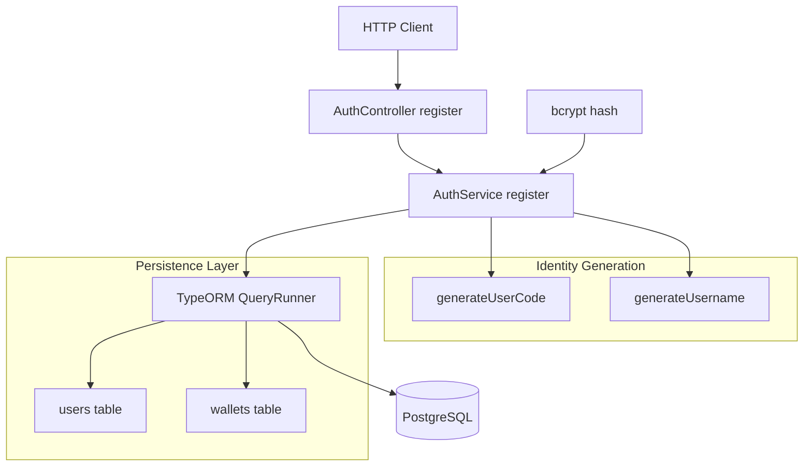
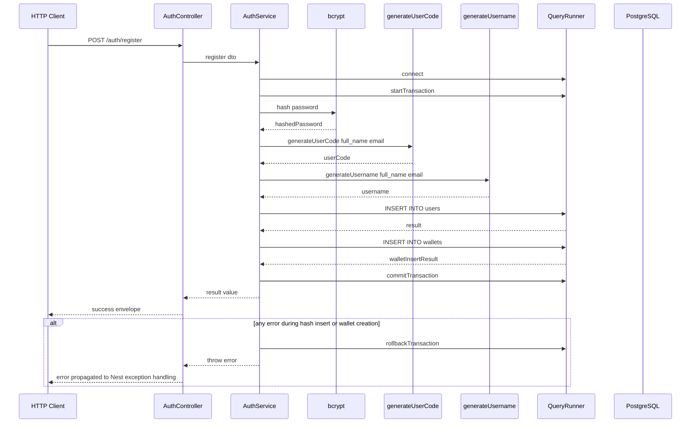

# Authentication Domain - User Registration Pipeline and Identity Generation

## Overview

The registration path in  and  creates a new application user and immediately provisions that user’s wallet record in the same transactional flow. The handler accepts a loose `dto: any` payload, hashes the submitted password with `bcrypt`, generates identity values with , inserts the user into `users`, and then creates the matching `wallets` row.

This feature is the bootstrap point for a user’s authenticated and financial presence in the system. The `users` row stores the account identity, while the wallet row gives the account a balance container that later wallet and ledger operations can rely on.

## Architecture Overview



## Component Structure

### 1. Controller Layer

#### **AuthController**

AuthController.register accepts dto: any, so the CreateUserDto validation model in  is not enforced at runtime by this endpoint. The service also reads result[0].id after INSERT INTO users ..., even though the SQL does not include a RETURNING id clause, so the wallet insert depends on a result shape the query does not explicitly request.

*`src/auth/auth.controller.ts`*

`AuthController` exposes the `/auth/register` HTTP endpoint and forwards the incoming payload to `AuthService.register`. It wraps the service result in a success envelope and rethrows any error after logging it.

**Properties**

| Property | Type | Description |
| --- | --- | --- |
| `authService` | `AuthService` | Handles registration persistence and identity generation. |


**Constructor Dependencies**

| Type | Description |
| --- | --- |
| `AuthService` | Service used to execute the registration pipeline. |


**Public Methods**

| Method | Description |
| --- | --- |
| `register` | Accepts the registration payload and returns the success response wrapper. |


#### Register User

```api
{
    "title": "Register User",
    "description": "Creates a user record inside a database transaction, hashes the password with bcrypt, generates `user_code` and `username`, and creates the matching wallet row.",
    "method": "POST",
    "baseUrl": "<AuthApiBaseUrl>",
    "endpoint": "/auth/register",
    "headers": [
        {
            "key": "Content-Type",
            "value": "application/json",
            "required": true
        }
    ],
    "queryParams": [],
    "pathParams": [],
    "bodyType": "json",
    "requestBody": "{\n    \"user_code\": \"JGALICE9X1Q\",\n    \"full_name\": \"Jane Grace Alvarez\",\n    \"username\": \"jgral712\",\n    \"email\": \"jane.alvarez@example.com\",\n    \"password\": \"P@ssw0rd123!\",\n    \"dob\": \"1994-08-21\",\n    \"profile_image_url\": \"https://cdn.example.com/profiles/jane-alvarez.png\",\n    \"is_email_verified\": false,\n    \"referral_code\": \"REF2024X9\",\n    \"referred_by_user_id\": 42,\n    \"vip_level\": 0,\n    \"account_status\": \"ACTIVE\",\n    \"last_login_at\": \"2026-03-28T10:15:00.000Z\",\n    \"created_at\": \"2026-03-28T10:15:00.000Z\",\n    \"updated_at\": \"2026-03-28T10:15:00.000Z\"\n}",
    "formData": [],
    "rawBody": "",
    "responses": {
        "201": {
            "description": "Success",
            "body": "{\n    \"status\": \"success\",\n    \"Code\": 201,\n    \"message\": \"User registered successfully\"\n}"
        }
    }
}
```

### 2. Business Layer

#### **AuthService**

*`src/auth/auth.service.ts`*

`AuthService.register` owns the registration transaction. It opens a `QueryRunner`, starts a transaction, hashes the password, generates identity values, inserts the user, creates the wallet row, and commits the transaction. Any exception triggers rollback and is rethrown to the controller.

**Properties**

| Property | Type | Description |
| --- | --- | --- |
| `dataSource` | `DataSource` | Provides the TypeORM connection and query runner factory. |
| `jwtService` | `JwtService` | Injected through `AuthModule`; not used by `register`, but present on the service. |


**Constructor Dependencies**

| Type | Description |
| --- | --- |
| `DataSource` | Creates the `QueryRunner` and executes raw SQL. |
| `JwtService` | Available on the service instance through Nest injection. |


**Public Methods**

| Method | Description |
| --- | --- |
| `register` | Executes the user and wallet creation transaction. |


### 3. Data Model Layer

#### **CreateUserDto**

*`src/auth/dto/user-dto.ts`*

`CreateUserDto` defines the broader registration shape and validation rules for authentication-related user creation. The current controller does not bind this class directly, but the decorators show the intended field contract.

| Property | Type | Validation and Default |  |
| --- | --- | --- | --- |
| `user_code` | `string \ | undefined` | `@IsString()`, `@MaxLength(30)` |
| `full_name` | `string \ | undefined` | `@IsOptional()`, `@IsString()`, `@MaxLength(150)` |
| `username` | `string \ | undefined` | `@IsString()`, `@MaxLength(80)` |
| `email` | `string \ | undefined` | `@IsOptional()`, `@IsEmail()`, `@MaxLength(150)` |
| `password` | `string` | `@IsString()` |  |
| `dob` | `string \ | undefined` | `@IsOptional()`, `@IsDateString()` |
| `profile_image_url` | `string \ | undefined` | `@IsOptional()`, `@IsString()` |
| `is_email_verified` | `boolean \ | undefined` | `@IsOptional()`, `@IsBoolean()`, default `false` |
| `referral_code` | `string` | `@IsString()`, `@MaxLength(30)` |  |
| `referred_by_user_id` | `number \ | undefined` | `@IsOptional()`, `@IsNumber()` |
| `vip_level` | `number \ | undefined` | `@IsOptional()`, `@IsNumber()`, `@Min(0)`, default `0` |
| `account_status` | `string \ | undefined` | `@IsOptional()`, `@IsString()`, `@IsIn(['ACTIVE', 'BLOCKED', 'SUSPENDED'])`, default `'ACTIVE'` |
| `last_login_at` | `string \ | undefined` | `@IsOptional()`, `@IsDateString()` |
| `created_at` | `string \ | undefined` | `@IsOptional()`, `@IsDateString()` |
| `updated_at` | `string \ | undefined` | `@IsOptional()`, `@IsDateString()` |


### 4. Identity Generation Utilities

#### **generateUsername**

*`src/auth/utils/index.ts`*

Builds a lowercase username using:

- initials from `fullName`
- the first 3 characters of the email local part
- a random 3-digit suffix from `100` to `999`

| Function | Output Pattern | Notes |
| --- | --- | --- |
| `generateUsername` | `initials + emailPart + randomNum` | Returns a lowercase string such as `jdjo123` |


#### **generateUserCode**

*`src/auth/utils/index.ts`*

Builds an uppercase user code using:

- initials from `fullName`
- the first 3 characters of the email local part
- a random 4-character base36 substring

| Function | Output Pattern | Notes |
| --- | --- | --- |
| `generateUserCode` | `INITIALS + EMAILPART + RANDOM` | Returns an uppercase string such as `JDJO1A2B` |


## Feature Flows

### Registration Transaction Flow



### Step by Step Execution

1. The controller receives a `POST /auth/register` request body.
2. `AuthController.register` passes the payload directly to `AuthService.register`.
3. `AuthService.register` creates a `QueryRunner` from `DataSource`.
4. The service calls `connect()` and `startTransaction()`.
5. `bcrypt.hash(dto.password, 10)` produces the stored password hash.
6. `generateUserCode(dto.full_name, dto.email)` creates the `user_code`.
7. `generateUsername(dto.full_name, dto.email)` creates the `username`.
8. The service inserts a row into `users`.
9. The service reads `result[0].id` and uses it for the wallet insert.
10. The service inserts a row into `wallets` with the new user id.
11. The service commits the transaction.
12. If any step throws, the service rolls back and rethrows the error.

## API Integration

### Registration Endpoint Contract

The registration handler is the only HTTP endpoint documented in this section. It is unguarded in the controller and does not use the JWT auth guard.

| Endpoint | Method | Auth Required | Description |
| --- | --- | --- | --- |
| `/auth/register` | `POST` | No | Creates the user identity and provisioning wallet record in one transaction. |


## State Management

### Registration Transaction State

| State | Trigger | Result |
| --- | --- | --- |
| `connected` | `queryRunner.connect()` succeeds | A dedicated DB connection is available. |
| `transaction_started` | `queryRunner.startTransaction()` succeeds | User and wallet writes are grouped. |
| `committed` | Both inserts succeed | The new user and wallet persist together. |
| `rolled_back` | Any error is thrown | Partial registration work is discarded. |


## Error Handling

`AuthController.register` logs the error and rethrows it. `AuthService.register` performs the actual rollback before rethrowing, so the controller does not transform the failure into a custom response.

Observed failure behavior in the code:

- If password hashing fails, the transaction is rolled back.
- If either insert fails, the transaction is rolled back.
- If any identity generation step fails, the transaction is rolled back.
- The controller does not map registration errors to a custom status body.

## Dependencies

| Dependency | Role in Registration |
| --- | --- |
| `@nestjs/common` | Provides `@Controller`, `@Post`, and exception handling types. |
| `@nestjs/jwt` | Supplies `JwtService` to `AuthService` through `AuthModule`. |
| `typeorm` | Provides `DataSource` and `QueryRunner` for raw SQL and transaction control. |
| `bcrypt` | Hashes the incoming password before persistence. |
| `class-validator` | Defines the broader `CreateUserDto` contract. |
| PostgreSQL `users` table | Stores the generated account identity and hashed password. |
| PostgreSQL `wallets` table | Stores the auto-created wallet linked to the new user. |
|  | Generates `user_code` and `username`. |


 registers `JwtModule` with the secret `'your-secret-key'` and exports `JwtModule`, which makes `JwtService` available to `AuthService`.

## Testing Considerations

The repository includes  and , and both currently verify only that the class can be created by Nest testing. The registration pipeline itself is not exercised in those specs.

Relevant scenarios implied by the code:

- successful registration commits both inserts
- a hash or insert failure triggers rollback
- generated `user_code` and `username` are passed into the user insert
- the wallet insert receives the new user id from the previous insert result

## Key Classes Reference

| Class | Responsibility |
| --- | --- |
| `auth.controller.ts` | Exposes `POST /auth/register` and wraps the service result in a success response. |
| `auth.service.ts` | Runs the registration transaction, hashes the password, creates the user row, and auto-creates the wallet row. |
| `user-dto.ts` | Defines the broader `CreateUserDto` validation contract for registration data. |
|  | Generates `user_code` and `username` values from `full_name` and `email`. |
| `auth.module.ts` | Registers `JwtModule` and wires authentication dependencies for `AuthService`. |
