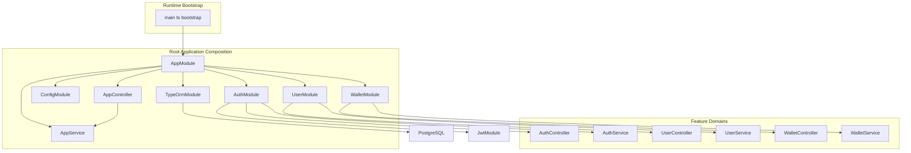
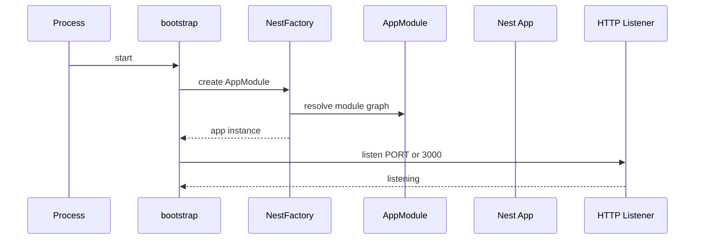
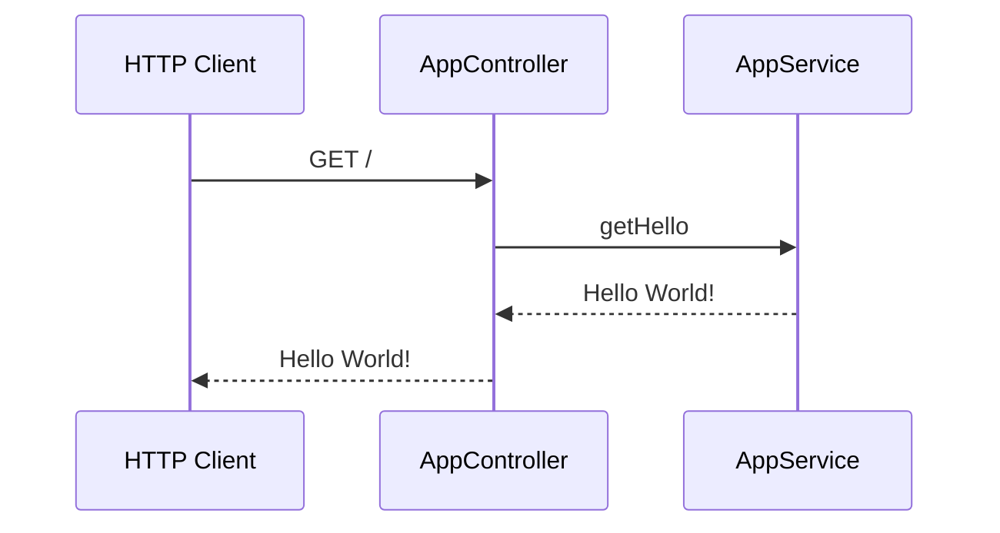

# Core Architecture and Runtime

## Overview

The runtime for `win-x88` starts in , where the Nest application is created from `AppModule` and bound to `process.env.PORT` or `3000`. The root module composes the global config layer, PostgreSQL connection setup, and the three feature domains: authentication, user management, and wallet management.

The root HTTP surface is intentionally small.  exposes the `GET /` entrypoint and delegates its response to , which returns the fixed `"Hello World!"` payload used by the root route test. `README.md` is still the default Nest starter content, so the actual runtime wiring for this service lives in the source files below rather than in project-specific documentation.

## Architecture Overview



## Runtime Bootstrap

### `bootstrap` ()

README.md is the default Nest starter README. The application bootstrap, module composition, and request entrypoints are defined in , , , and .

The application starts from a single async bootstrap function. It creates a Nest application instance from `AppModule` and starts the HTTP listener on the configured port.

**Behavior**

- Creates the application with `NestFactory.create(AppModule)`
- Listens on `process.env.PORT ?? 3000`
- Runs immediately by invoking `bootstrap()`



## Root Application Module

### `AppModule` ()

`AppModule` is the composition root. It wires the global configuration layer, database connection bootstrap, and the three feature domains into a single Nest application graph.

**Module wiring**

| Import | Role |
| --- | --- |
| `ConfigModule.forRoot({ isGlobal: true })` | Loads environment values globally for the application |
| `TypeOrmModule.forRootAsync(...)` | Builds the PostgreSQL connection from `ConfigService` values |
| `AuthModule` | Authentication domain container |
| `WalletModule` | Wallet domain container |
| `UserModule` | User domain container |


**TypeORM bootstrap values used by the module**

| Setting | Source |
| --- | --- |
| `type: 'postgres'` | Static configuration in the factory |
| `host` | `DB_HOST` from `ConfigService` |
| `port` | `DB_PORT` from `ConfigService` |
| `username` | `DB_USER` from `ConfigService` |
| `password` | `DB_PASS` from `ConfigService` |
| `database` | `DB_NAME` from `ConfigService` |
| `autoLoadEntities` | `true` |
| `synchronize` | `true` |


**Composition boundaries**

- Root-level controllers and providers live in `AppController` and `AppService`
- Feature-specific request handling is delegated to `AuthModule`, `UserModule`, and `WalletModule`
- The root module does not carry business logic itself; it only assembles runtime dependencies

### Service Boundaries

| Boundary | Owned by root layer | Delegated to feature module |
| --- | --- | --- |
| Bootstrap and app startup |  and `AppModule` | None |
| Shared configuration | `ConfigModule` in `AppModule` | Consumed by `AppService` and `TypeOrmModule` |
| Authentication | None | `AuthModule` |
| User and phone management | None | `UserModule` |
| Wallet domain wiring | None | `WalletModule` |


## Root Controller

### `AppController` ()

`AppController` exposes the root HTTP entrypoint. It injects `AppService` and forwards the `GET /` response directly from `getHello()`.

#### Properties

| Property | Type | Description |
| --- | --- | --- |
| `appService` | `AppService` | Service used to produce the root response |


#### Constructor Dependencies

| Type | Description |
| --- | --- |
| `AppService` | Injected root service that supplies the response string |


#### Public Methods

| Method | Description |
| --- | --- |
| `getHello` | Handles the root `GET /` request and returns the `AppService` message |


#### Root Hello Message

```api
{
    "title": "Root Hello Message",
    "description": "Returns the root application greeting from AppService",
    "method": "GET",
    "baseUrl": "<AppBaseUrl>",
    "endpoint": "/",
    "headers": [],
    "queryParams": [],
    "pathParams": [],
    "bodyType": "none",
    "requestBody": "",
    "formData": [],
    "rawBody": "",
    "responses": {
        "200": {
            "description": "Success",
            "body": "Hello World!"
        }
    }
}
```

#### Request Flow

The request path is direct:

1. The Nest router maps `GET /` to `AppController.getHello()`
2. `AppController` calls `AppService.getHello()`
3. `AppService` returns the literal `"Hello World!"`
4. The controller returns that string to the client



## Root Service

### `AppService` ()

The GET / route has no guard or controller-level decorator in the provided code. The handler reaches AppService.getHello() directly.

`AppService` is the minimal runtime service at the application root. It reads configuration through `ConfigService` and exposes the string used by the root controller.

#### Properties

| Property | Type | Description |
| --- | --- | --- |
| `configService` | `ConfigService` | Reads environment-backed configuration values |


#### Constructor Dependencies

| Type | Description |
| --- | --- |
| `ConfigService` | Shared configuration access used by the service |


#### Public Methods

| Method | Description |
| --- | --- |
| `getDbHost` | Returns the `DB_HOST` value from `ConfigService`, or an empty string when unset |
| `getHello` | Returns the fixed root greeting string |


#### Runtime Behavior

| Method | Behavior |
| --- | --- |
| `getDbHost` | Reads `DB_HOST` and falls back to `""` |
| `getHello` | Returns `"Hello World!"` with no transformation |


## Feature Domain Integration

### `AuthModule` ()

`AuthModule` is imported by `AppModule` to provide the authentication domain. It registers `JwtModule` locally and exports it for downstream consumers inside the application.

### `UserModule` ()

`UserModule` is imported by `AppModule` to provide user profile and phone management. It also imports `AuthModule` and exports `JwtAuthGuard`, making the shared JWT guard available to the user domain wiring.

### `WalletModule` ()

`WalletModule` is imported by `AppModule` to keep wallet-related runtime wiring isolated from the root module. Its controller and service are part of the application graph assembled by `AppModule`.

### Integration Points

- `AppModule` is the root composition point for all runtime modules
- `ConfigModule` provides shared environment values
- `TypeOrmModule` establishes the database connection used by feature services
- `AuthModule`, `UserModule`, and `WalletModule` each own their own controller and service pair
- `AppController` and `AppService` remain separate from domain-specific feature logic

## Request Entrypoints

### Root HTTP Endpoint

The only root-level endpoint in this section is `GET /`, implemented by `AppController.getHello()`.

**Runtime path**

-  starts the application
-  registers `AppController`
-  exposes the root route
-  provides the response payload

**Observed response shape**

- Plain string: `"Hello World!"`

## Testing Considerations

### 

The root controller test suite verifies the runtime contract of `AppController.getHello()` by asserting that it returns `"Hello World!"`. That aligns with the live `GET /` endpoint behavior.

## README Status

`README.md` remains the default Nest starter documentation rather than a project-specific architecture guide. The runtime behavior documented here is derived from the source files under `src/`.

## Key Classes Reference

| Class | Responsibility |
| --- | --- |
| `main.ts` | Creates the Nest application and starts the HTTP listener |
| `app.module.ts` | Composes config, database, and feature modules into the root application |
| `app.controller.ts` | Exposes the root `GET /` endpoint |
| `app.service.ts` | Supplies the root greeting string and config access |
| `auth.module.ts` | Packages the authentication domain and JWT module wiring |
| `user.module.ts` | Packages user and phone management wiring |
| `wallet.module.ts` | Packages wallet domain wiring |
