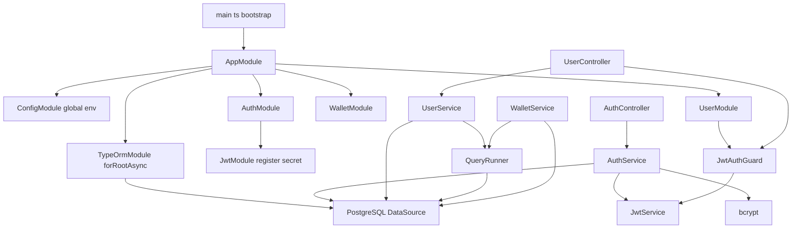
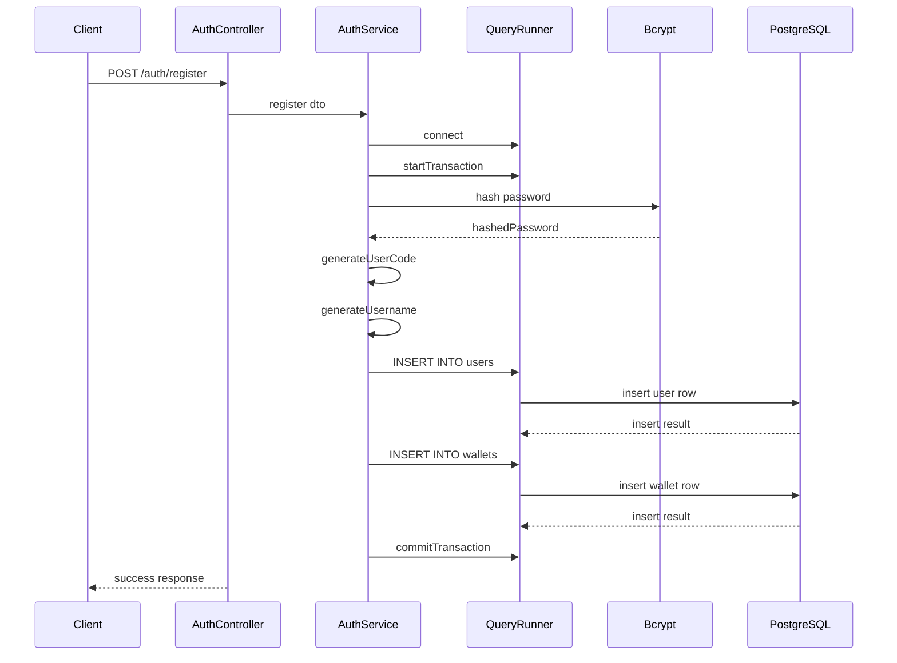
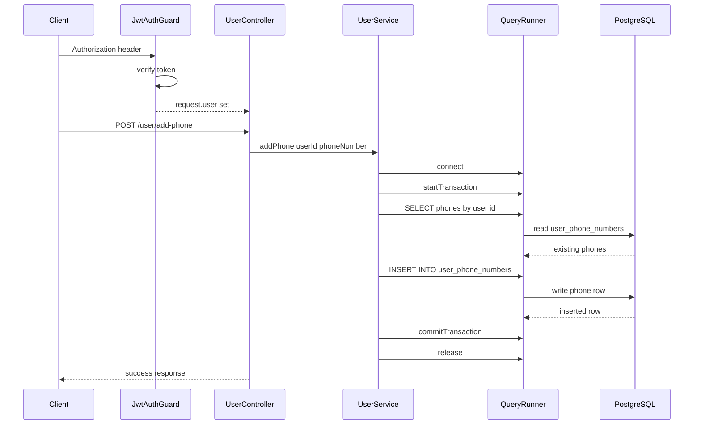

# Core Architecture and Runtime - Configuration model, database connectivity, and persistence style

## Overview

`win-x88` boots as a single NestJS 11 service from `AppModule`, with global `.env` loading and a PostgreSQL connection that is assembled at runtime from `DB_HOST`, `DB_PORT`, `DB_USER`, `DB_PASS`, and `DB_NAME`. The same runtime also wires JWT signing, `bcrypt` password handling, and a small set of controllers that expose authentication, profile, phone-number, and wallet-related operations.

The persistence style in the service layer is intentionally direct: , , and  use raw SQL through `DataSource.query` and `queryRunner.query` rather than repositories or entity methods. That keeps SQL visible at the call site and gives explicit transaction control, but it also hard-couples business logic to table names, column names, and SQL result shapes.

## Architecture Overview



## Runtime Configuration Model

The runtime configuration is split between environment-driven database settings, a hardcoded JWT secret in `AuthModule`, and direct `process.env` access in the bootstrap path.

### Environment and inline runtime settings

| Source | Value | Used by | Effect |
| --- | --- | --- | --- |
| `.env` via `ConfigModule.forRoot({ isGlobal: true })` | Global configuration | `AppModule`, `AppService` | Makes `ConfigService` available application-wide |
| `DB_HOST` | PostgreSQL host | `TypeOrmModule.forRootAsync`, `AppService.getDbHost()` | Connection target and diagnostic accessor |
| `DB_PORT` | PostgreSQL port | `TypeOrmModule.forRootAsync` | Passed as a number to the TypeORM connection factory |
| `DB_USER` | PostgreSQL username | `TypeOrmModule.forRootAsync` | Database authentication user |
| `DB_PASS` | PostgreSQL password | `TypeOrmModule.forRootAsync` | Database authentication password |
| `DB_NAME` | PostgreSQL database name | `TypeOrmModule.forRootAsync` | Database selected for the service |
| `PORT` | HTTP listen port | `main.ts` | `app.listen(process.env.PORT ?? 3000)` |
| `your-secret-key` | JWT signing secret | `AuthModule` | Used by `JwtModule.register` |


### `AppModule`

*src/app.module.ts*

`AppModule` is the composition point for the runtime. It imports `ConfigModule`, configures TypeORM asynchronously from `ConfigService`, and then brings in `AuthModule`, `WalletModule`, and `UserModule`.

| Property | Type | Description |
| --- | --- | --- |
| `imports` | `Array` | Loads `ConfigModule`, configures PostgreSQL via `TypeOrmModule.forRootAsync`, and registers feature modules |
| `controllers` | `Array` | Registers `AppController` |
| `providers` | `Array` | Registers `AppService` |


### `AppService`

*src/app.service.ts*

`AppService` is a small runtime helper around `ConfigService`. It exposes one config accessor and the default hello response.

#### Constructor dependencies

| Type | Description |
| --- | --- |
| `ConfigService` | Reads environment-backed configuration values |


#### Properties

| Property | Type | Description |
| --- | --- | --- |
| `configService` | `ConfigService` | Injected configuration reader |


#### Public methods

| Method | Description |
| --- | --- |
| `getDbHost` | Returns `DB_HOST` or an empty string |
| `getHello` | Returns the fixed string `Hello World!` |


### `AppController`

*src/app.controller.ts*

`AppController` exposes the root response and delegates directly to `AppService`.

#### Constructor dependencies

| Type | Description |
| --- | --- |
| `AppService` | Supplies the root response string |


#### Properties

| Property | Type | Description |
| --- | --- | --- |
| `appService` | `AppService` | Injected application service |


#### Public methods

| Method | Description |
| --- | --- |
| `getHello` | Returns the root response string from `AppService` |


### `AuthModule`

*src/auth/auth.module.ts*

`AuthModule` owns JWT setup for the service. It registers `JwtModule` with a literal secret and exports `JwtModule` so the guard and authentication service can use it.

| Property | Type | Description |
| --- | --- | --- |
| `imports` | `Array` | Registers `JwtModule` with the configured secret |
| `controllers` | `Array` | Registers `AuthController` |
| `providers` | `Array` | Registers `AuthService` |
| `exports` | `Array` | Exposes `JwtModule` to other modules |


### `JwtAuthGuard`

*src/common/guards/jwt-auth.guard.ts*

`JwtAuthGuard` is the request gate used by `UserController`. It reads the `authorization` header, verifies the bearer token with `JwtService`, and attaches the decoded payload to `request.user`.

#### Constructor dependencies

| Type | Description |
| --- | --- |
| `JwtService` | Verifies the JWT token from the request header |


#### Properties

| Property | Type | Description |
| --- | --- | --- |
| `jwtService` | `JwtService` | JWT verification service |


#### Public methods

| Method | Description |
| --- | --- |
| `canActivate` | Validates the bearer token, populates `request.user`, and blocks unauthorized requests |


### `UserModule`

*src/user/user.module.ts*

`UserModule` wires `UserService`, `UserController`, and `JwtAuthGuard` into the runtime.

| Property | Type | Description |
| --- | --- | --- |
| `imports` | `Array` | Imports `AuthModule` so JWT services are available in the module graph |
| `controllers` | `Array` | Registers `UserController` |
| `providers` | `Array` | Registers `UserService` and `JwtAuthGuard` |
| `exports` | `Array` | Exports `JwtAuthGuard` |


### `WalletModule`

*src/wallet/wallet.module.ts*

`WalletModule` registers the wallet controller shell and the wallet service.

| Property | Type | Description |
| --- | --- | --- |
| `controllers` | `Array` | Registers `WalletController` |
| `providers` | `Array` | Registers `WalletService` |


## Database Connectivity and Persistence Style

The PostgreSQL connection is built in `TypeOrmModule.forRootAsync` using `ConfigService` lookups for `DB_HOST`, `DB_PORT`, `DB_USER`, `DB_PASS`, and `DB_NAME`. The connection also sets `autoLoadEntities: true` and `synchronize: true`.

### Connection options in `AppModule`

| Option | Value | Runtime effect |
| --- | --- | --- |
| `type` | `postgres` | Targets PostgreSQL |
| `host` | `configService.get<string>('DB_HOST')!` | Uses the configured database host |
| `port` | `configService.get<number>('DB_PORT')!` | Uses the configured database port |
| `username` | `configService.get<string>('DB_USER')!` | Uses the configured database user |
| `password` | `configService.get<string>('DB_PASS')!` | Uses the configured database password |
| `database` | `configService.get<string>('DB_NAME')!` | Uses the configured database name |
| `autoLoadEntities` | `true` | Picks up entities that are registered in imported feature modules |
| `synchronize` | `true` | Lets TypeORM sync schema from entity metadata on startup |


### Persistence style by service

| Service | Access style | Tables touched | Transaction style |
| --- | --- | --- | --- |
| `AuthService` | `DataSource.query` and `queryRunner.query` | `users`, `wallets`, `refresh_tokens`, `admin_users` | Mixed; explicit transactions for registration methods |
| `UserService` | `DataSource.query` and `queryRunner.query` | `users`, `user_phone_numbers`, `wallets` | Explicit transactions for phone mutation methods |
| `WalletService` | Caller-supplied `queryRunner.query` | `wallets`, `financial_ledger` | Caller-owned transaction boundary with row locking |


### Operational implications

The SQL in these services is schema-coupled to the table and column names used in the strings. A rename of `users.email`, `wallets.available_balance`, or `user_phone_numbers.is_primary` requires code changes in every query that mentions that column.

Because the code path mostly bypasses repositories and entity methods, the practical source of truth for persistence is the SQL in the service layer, not any repository abstraction. `autoLoadEntities: true` and `synchronize: true` only affect entities that actually exist in the module graph; they do not remove the need to keep these raw SQL statements and the live schema in sync.

### Transaction discipline in the service layer

| Method group | Transaction behavior | Important detail |
| --- | --- | --- |
| `AuthService.register`, `AuthService.adminRegister` | Manual transaction with `queryRunner` | Commits or rolls back explicitly |
| `UserService.addPhone`, `setPrimaryPhone`, `deletePhone` | Manual transaction with `queryRunner` | Releases the runner in `finally` |
| `WalletService.credit`, `lockAmount`, `debitLocked`, `releaseLocked` | Uses caller-owned `queryRunner` | Assumes the caller already started a transaction |
| `AuthService.login`, `refreshToken`, `logout`, `getProfile`, `adminLogin`, `UserService.getProfile`, `updateProfile`, `verifyPhone`, `getUserDetailsByAdmin` | Direct `DataSource.query` | No transaction boundary in the method itself |


### Schema coupling points

| Code path | Coupled database objects | Notes |
| --- | --- | --- |
| `AuthService.register` | `users`, `wallets` | Creates user and wallet together |
| `AuthService.login` | `users`, `refresh_tokens` | Reads user row and persists hashed refresh token |
| `AuthService.refreshToken` | `refresh_tokens` | Compares token against stored hashes |
| `AuthService.logout` | `refresh_tokens` | Revokes all tokens for the decoded user |
| `AuthService.adminLogin`, `adminRegister` | `admin_users`, `refresh_tokens` | Uses the admin table and token store |
| `UserService.getProfile`, `updateProfile`, `getUserDetailsByAdmin` | `users`, `user_phone_numbers`, `wallets` | Reads user profile and related records |
| `UserService.addPhone`, `setPrimaryPhone`, `deletePhone`, `verifyPhone` | `user_phone_numbers` | Mutates phone records with row-level rules |
| `WalletService` methods | `wallets`, `financial_ledger` | Updates balances and writes ledger rows |


## Class and Service Reference

### `AuthController`

AuthService.register and AuthService.adminRegister create a queryRunner, start a transaction, and commit or roll back, but they never call release(). The same code path also reads result[0].id after INSERT INTO users without a RETURNING clause, so the follow-up wallet insert depends on a result shape that the query does not establish. [!NOTE] UserController.updateProfile reads req.user?.id, while JwtAuthGuard writes the decoded token into request.user with sub. The authenticated user id is therefore undefined in this handler, so the update query receives an invalid user id even when the request is already authorized.

*src/auth/auth.controller.ts*

`AuthController` exposes authentication and profile endpoints. It converts service results into the response envelope used by the auth routes.

#### Constructor dependencies

| Type | Description |
| --- | --- |
| `AuthService` | Performs registration, sign-in, token refresh, logout, and profile reads |


#### Properties

| Property | Type | Description |
| --- | --- | --- |
| `authService` | `AuthService` | Injected authentication service |


#### Public methods

| Method | Description |
| --- | --- |
| `register` | Registers a user and returns a success wrapper |
| `login` | Authenticates a user and returns JWT tokens |
| `refreshToken` | Exchanges a refresh token for a new access token |
| `logout` | Revokes refresh tokens for the decoded user |
| `getProfile` | Reads a user profile by `userId` path parameter |
| `loginAdmin` | Authenticates an admin user and returns admin tokens |


### `AuthService`

*src/auth/auth.service.ts*

`AuthService` performs the authentication data flow directly against PostgreSQL. It hashes passwords with `bcrypt`, signs JWTs with `JwtService`, and stores refresh-token hashes in `refresh_tokens`.

#### Constructor dependencies

| Type | Description |
| --- | --- |
| `DataSource` | Executes raw SQL and creates query runners |
| `JwtService` | Signs and decodes JWTs |


#### Properties

| Property | Type | Description |
| --- | --- | --- |
| `dataSource` | `DataSource` | TypeORM data source used for raw SQL |
| `jwtService` | `JwtService` | JWT signing and decoding service |


#### Public methods

| Method | Description |
| --- | --- |
| `register` | Creates a user row and a wallet row inside a transaction |
| `login` | Validates credentials and stores a hashed refresh token |
| `refreshToken` | Verifies a refresh token hash and returns a new access token |
| `logout` | Revokes all refresh tokens for the decoded user |
| `getProfile` | Returns a profile projection for a user id |
| `adminLogin` | Validates admin credentials and stores a hashed refresh token |
| `adminRegister` | Creates an admin user row inside a transaction |


### `CreateUserDto`

*src/auth/dto/user-dto.ts*

`CreateUserDto` defines the registration payload shape and attaches `class-validator` rules to each field.

#### Properties

| Property | Type | Description |
| --- | --- | --- |
| `user_code` | `string \ | undefined` | Max length 30, string |
| `full_name` | `string` | Optional, max length 150 |
| `username` | `string \ | undefined` | Max length 80, string |
| `email` | `string` | Optional, email format, max length 150 |
| `password` | `string` | Required string |
| `dob` | `string` | Optional ISO date string |
| `profile_image_url` | `string` | Optional string |
| `is_email_verified` | `boolean` | Optional boolean, default `false` |
| `referral_code` | `string` | Required string, max length 30 |
| `referred_by_user_id` | `number` | Optional numeric reference |
| `vip_level` | `number` | Optional number, minimum `0`, default `0` |
| `account_status` | `string` | Optional, one of `ACTIVE`, `BLOCKED`, `SUSPENDED`, default `ACTIVE` |
| `last_login_at` | `string` | Optional ISO date string |
| `created_at` | `string` | Optional ISO date string |
| `updated_at` | `string` | Optional ISO date string |


### `JwtAuthGuard`

*src/common/guards/jwt-auth.guard.ts*

`JwtAuthGuard` protects the user routes by validating the bearer token in the `authorization` header and attaching the decoded payload to the request object.

#### Constructor dependencies

| Type | Description |
| --- | --- |
| `JwtService` | Verifies the bearer token and decodes the payload |


#### Properties

| Property | Type | Description |
| --- | --- | --- |
| `jwtService` | `JwtService` | JWT verification service |


#### Public methods

| Method | Description |
| --- | --- |
| `canActivate` | Reads `authorization`, verifies the token, and attaches `request.user` |


### `UserController`

*src/user/user.controller.ts*

`UserController` is guarded by `JwtAuthGuard` and exposes profile and phone-number mutation endpoints for the signed-in user.

#### Constructor dependencies

| Type | Description |
| --- | --- |
| `UserService` | Handles profile and phone-number persistence |


#### Properties

| Property | Type | Description |
| --- | --- | --- |
| `userService` | `UserService` | Injected user service |


#### Public methods

| Method | Description |
| --- | --- |
| `getProfile` | Returns the current user profile using `req.user.sub` |
| `updateProfile` | Updates `full_name`, `dob`, or `profile_image_url` |
| `addPhoneNumber` | Adds a phone number to the current user |
| `setPrimaryPhone` | Marks one phone as primary |
| `deletePhone` | Deletes a phone record |
| `verifyPhone` | Marks a phone record as verified |


### `UserService`

*src/user/user.service.ts*

`UserService` is the main profile and phone-number persistence layer. It uses direct SQL for reads and writes and coordinates transactional phone updates with `queryRunner`.

#### Constructor dependencies

| Type | Description |
| --- | --- |
| `DataSource` | Executes SQL and creates query runners |


#### Properties

| Property | Type | Description |
| --- | --- | --- |
| `dataSource` | `DataSource` | TypeORM data source used for raw SQL |


#### Public methods

| Method | Description |
| --- | --- |
| `getProfile` | Returns user profile data plus associated phone rows |
| `updateProfile` | Dynamically updates selected profile fields and stamps `updated_at` |
| `addPhone` | Inserts a phone number after validation, duplicate checks, and max-count checks |
| `setPrimaryPhone` | Switches the primary phone for a user in a transaction |
| `deletePhone` | Deletes a phone row with primary-phone protection rules |
| `verifyPhone` | Marks a phone as verified |
| `getUserDetailsByAdmin` | Returns a broader admin-facing user summary with wallet and phone data |


### `WalletController`

*src/wallet/wallet.controller.ts*

`WalletController` is present as the module controller shell, but no route handlers are declared in the provided source.

#### Properties

| Property | Type | Description |
| --- | --- | --- |
| `none` | `—` | No instance properties are declared |


#### Public methods

| Method | Description |
| --- | --- |
| `none` | No public controller methods are declared |


### `WalletService`

*src/wallet/wallet.service.ts*

`WalletService` implements wallet balance movement and ledger writing with caller-managed transactions and row locking.

#### Constructor dependencies

| Type | Description |
| --- | --- |
| `DataSource` | Provides access to query runners and SQL execution |


#### Properties

| Property | Type | Description |
| --- | --- | --- |
| `dataSource` | `DataSource` | TypeORM data source used for wallet persistence |


#### Public methods

| Method | Description |
| --- | --- |
| `getWalletForUpdate` | Reads the wallet row for a user with `FOR UPDATE` locking |
| `credit` | Adds available balance and writes a ledger entry |
| `lockAmount` | Moves funds from available to locked balance |
| `debitLocked` | Finalizes a withdrawal from locked balance |
| `releaseLocked` | Releases locked funds back to available balance |


### Supporting Utilities

*src/auth/utils/index.ts*

These helpers are used only by `AuthService.register`.

- `generateUsername(fullName, email)`: derives a lowercase username from initials, the email prefix, and a random 3-digit number.
- `generateUserCode(fullName, email)`: derives an uppercase user code from initials, the email prefix, and a random 4-character alphanumeric suffix.

## Feature Flows

### Registration and wallet bootstrap

`AuthService.register` is the clearest example of the persistence style used in this codebase. It opens a query runner, hashes the password, generates user identifiers, inserts the user row, and then inserts the wallet row in the same transaction.



### Guarded user profile and phone mutation flow

The user endpoints run through `JwtAuthGuard` before the controller body executes. The guard verifies the bearer token and writes the decoded payload to `request.user`, which the controller then uses to identify the current user.



## API Endpoints

### Root Hello

*src/app.controller.ts*

#### Get Hello

```api
{
    "title": "Get Hello",
    "description": "Returns the fixed root response string from AppService",
    "method": "GET",
    "baseUrl": "<WinX88ApiBaseUrl>",
    "endpoint": "/",
    "headers": [],
    "queryParams": [],
    "pathParams": [],
    "bodyType": "none",
    "requestBody": "",
    "formData": [],
    "rawBody": "",
    "responses": {
        "200": {
            "description": "Success",
            "body": "Hello World!"
        }
    }
}
```

### Authentication Endpoints

*src/auth/auth.controller.ts*

#### Register User

```api
{
    "title": "Register User",
    "description": "Creates a user record and a wallet record through AuthService.register",
    "method": "POST",
    "baseUrl": "<WinX88ApiBaseUrl>",
    "endpoint": "/auth/register",
    "headers": [
        {
            "key": "Content-Type",
            "value": "application/json",
            "required": true
        }
    ],
    "queryParams": [],
    "pathParams": [],
    "bodyType": "json",
    "requestBody": "{\n    \"full_name\": \"Jane Doe\",\n    \"email\": \"jane.doe@example.com\",\n    \"password\": \"StrongPass123!\",\n    \"referral_code\": \"REF2024A1\"\n}",
    "formData": [],
    "rawBody": "",
    "responses": {
        "201": {
            "description": "Success",
            "body": "{\n    \"status\": \"success\",\n    \"Code\": 201,\n    \"message\": \"User registered successfully\"\n}"
        },
        "401": {
            "description": "Unauthorized",
            "body": "{\n    \"statusCode\": 401,\n    \"message\": \"User not found\",\n    \"error\": \"Unauthorized\"\n}"
        }
    }
}
```

#### Login User

```api
{
    "title": "Login User",
    "description": "Authenticates a user, signs JWTs, and stores a hashed refresh token",
    "method": "POST",
    "baseUrl": "<WinX88ApiBaseUrl>",
    "endpoint": "/auth/login",
    "headers": [
        {
            "key": "Content-Type",
            "value": "application/json",
            "required": true
        }
    ],
    "queryParams": [],
    "pathParams": [],
    "bodyType": "json",
    "requestBody": "{\n    \"email\": \"jane.doe@example.com\",\n    \"password\": \"StrongPass123!\"\n}",
    "formData": [],
    "rawBody": "",
    "responses": {
        "200": {
            "description": "Success",
            "body": "{\n    \"status\": \"success\",\n    \"Code\": 200,\n    \"message\": \"User logged in successfully\",\n    \"data\": {\n        \"accessToken\": \"eyJhbGciOiJIUzI1NiIsInR5cCI6IkpXVCJ9.example\",\n        \"refreshToken\": \"eyJhbGciOiJIUzI1NiIsInR5cCI6IkpXVCJ9.example\",\n        \"user\": {\n            \"id\": 101,\n            \"username\": \"jdjane123\"\n        }\n    }\n}"
        },
        "401": {
            "description": "Unauthorized",
            "body": "{\n    \"statusCode\": 401,\n    \"message\": \"Invalid password\",\n    \"error\": \"Unauthorized\"\n}"
        }
    }
}
```

#### Refresh Access Token

```api
{
    "title": "Refresh Access Token",
    "description": "Validates a stored refresh token hash and returns a new access token",
    "method": "POST",
    "baseUrl": "<WinX88ApiBaseUrl>",
    "endpoint": "/auth/refresh-token",
    "headers": [
        {
            "key": "Content-Type",
            "value": "application/json",
            "required": true
        }
    ],
    "queryParams": [],
    "pathParams": [],
    "bodyType": "json",
    "requestBody": "{\n    \"refreshToken\": \"eyJhbGciOiJIUzI1NiIsInR5cCI6IkpXVCJ9.example\"\n}",
    "formData": [],
    "rawBody": "",
    "responses": {
        "200": {
            "description": "Success",
            "body": "{\n    \"status\": \"success\",\n    \"accessToken\": \"eyJhbGciOiJIUzI1NiIsInR5cCI6IkpXVCJ9.example\"\n}"
        },
        "401": {
            "description": "Unauthorized",
            "body": "{\n    \"statusCode\": 401,\n    \"message\": \"Invalid refresh token\",\n    \"error\": \"Unauthorized\"\n}"
        }
    }
}
```

#### Logout

```api
{
    "title": "Logout",
    "description": "Marks the decoded user's refresh tokens as revoked",
    "method": "POST",
    "baseUrl": "<WinX88ApiBaseUrl>",
    "endpoint": "/auth/logout",
    "headers": [
        {
            "key": "Content-Type",
            "value": "application/json",
            "required": true
        }
    ],
    "queryParams": [],
    "pathParams": [],
    "bodyType": "json",
    "requestBody": "{\n    \"refreshToken\": \"eyJhbGciOiJIUzI1NiIsInR5cCI6IkpXVCJ9.example\"\n}",
    "formData": [],
    "rawBody": "",
    "responses": {
        "200": {
            "description": "Success",
            "body": "{\n    \"status\": \"success\",\n    \"message\": \"Logged out successfully\"\n}"
        }
    }
}
```

#### Get Profile By User Id

```api
{
    "title": "Get Profile By User Id",
    "description": "Returns a selected user profile projection by path parameter",
    "method": "GET",
    "baseUrl": "<WinX88ApiBaseUrl>",
    "endpoint": "/auth/profile/:userId",
    "headers": [],
    "queryParams": [],
    "pathParams": [
        {
            "name": "userId",
            "type": "string",
            "required": true,
            "description": "User identifier"
        }
    ],
    "bodyType": "none",
    "requestBody": "",
    "formData": [],
    "rawBody": "",
    "responses": {
        "200": {
            "description": "Success",
            "body": "{\n    \"status\": \"success\",\n    \"Code\": 200,\n    \"message\": \"User profile retrieved successfully\",\n    \"data\": {\n        \"full_name\": \"Jane Doe\",\n        \"email\": \"jane.doe@example.com\",\n        \"username\": \"jdjane123\",\n        \"profile_image_url\": \"https://cdn.example.com/profiles/jane.png\",\n        \"account_status\": \"ACTIVE\",\n        \"user_code\": \"JDJANE1A2B\",\n        \"referral_code\": \"REF2024A1\"\n    }\n}"
        }
    }
}
```

#### Admin Login

```api
{
    "title": "Admin Login",
    "description": "Authenticates an admin user and stores a hashed refresh token",
    "method": "POST",
    "baseUrl": "<WinX88ApiBaseUrl>",
    "endpoint": "/auth/admin-login",
    "headers": [
        {
            "key": "Content-Type",
            "value": "application/json",
            "required": true
        }
    ],
    "queryParams": [],
    "pathParams": [],
    "bodyType": "json",
    "requestBody": "{\n    \"email\": \"admin@example.com\",\n    \"password\": \"AdminPass123!\"\n}",
    "formData": [],
    "rawBody": "",
    "responses": {
        "200": {
            "description": "Success",
            "body": "{\n    \"status\": \"success\",\n    \"code\": 200,\n    \"message\": \"Admin logged in successfully\",\n    \"data\": {\n        \"accessToken\": \"eyJhbGciOiJIUzI1NiIsInR5cCI6IkpXVCJ9.example\",\n        \"refreshToken\": \"eyJhbGciOiJIUzI1NiIsInR5cCI6IkpXVCJ9.example\",\n        \"admin\": {\n            \"id\": 1,\n            \"email\": \"admin@example.com\"\n        }\n    }\n}"
        },
        "401": {
            "description": "Unauthorized",
            "body": "{\n    \"status\": \"error\",\n    \"code\": 401,\n    \"message\": \"Admin not found\"\n}"
        }
    }
}
```

### User Endpoints

*src/user/user.controller.ts*

#### Get Current User Profile

```api
{
    "title": "Get Current User Profile",
    "description": "Returns the authenticated user's profile and phone list",
    "method": "GET",
    "baseUrl": "<WinX88ApiBaseUrl>",
    "endpoint": "/user/profile",
    "headers": [
        {
            "key": "Authorization",
            "value": "Bearer <token>",
            "required": true
        }
    ],
    "queryParams": [],
    "pathParams": [],
    "bodyType": "none",
    "requestBody": "",
    "formData": [],
    "rawBody": "",
    "responses": {
        "200": {
            "description": "Success",
            "body": "{\n    \"success\": true,\n    \"message\": \"User profile retrieved successfully\",\n    \"data\": {\n        \"id\": 101,\n        \"user_code\": \"JDJANE1A2B\",\n        \"full_name\": \"Jane Doe\",\n        \"username\": \"jdjane123\",\n        \"email\": \"jane.doe@example.com\",\n        \"dob\": \"1990-01-15\",\n        \"referral_code\": \"REF2024A1\",\n        \"vip_level\": 0,\n        \"account_status\": \"ACTIVE\",\n        \"created_at\": \"2025-01-15T10:00:00.000Z\",\n        \"phones\": [\n            {\n                \"id\": 501,\n                \"phone_number\": \"9876543210\",\n                \"is_primary\": true,\n                \"is_verified\": false\n            }\n        ]\n    }\n}"
        },
        "401": {
            "description": "Unauthorized",
            "body": "{\n    \"statusCode\": 401,\n    \"message\": \"No token provided\",\n    \"error\": \"Unauthorized\"\n}"
        }
    }
}
```

#### Update Current User Profile

```api
{
    "title": "Update Current User Profile",
    "description": "Updates full_name, dob, or profile_image_url for the authenticated user",
    "method": "POST",
    "baseUrl": "<WinX88ApiBaseUrl>",
    "endpoint": "/user/update-profile",
    "headers": [
        {
            "key": "Authorization",
            "value": "Bearer <token>",
            "required": true
        },
        {
            "key": "Content-Type",
            "value": "application/json",
            "required": true
        }
    ],
    "queryParams": [],
    "pathParams": [],
    "bodyType": "json",
    "requestBody": "{\n    \"full_name\": \"Jane A. Doe\",\n    \"dob\": \"1990-01-15\",\n    \"profile_image_url\": \"https://cdn.example.com/profiles/jane-new.png\"\n}",
    "formData": [],
    "rawBody": "",
    "responses": {
        "200": {
            "description": "Success",
            "body": "{\n    \"success\": true,\n    \"message\": \"Profile updated successfully\",\n    \"data\": {\n        \"message\": \"Profile updated successfully\"\n    }\n}"
        },
        "400": {
            "description": "Bad Request",
            "body": "{\n    \"statusCode\": 400,\n    \"message\": \"Nothing to update\",\n    \"error\": \"Bad Request\"\n}"
        }
    }
}
```

#### Add Phone Number

```api
{
    "title": "Add Phone Number",
    "description": "Adds a phone number to the authenticated user's phone list",
    "method": "POST",
    "baseUrl": "<WinX88ApiBaseUrl>",
    "endpoint": "/user/add-phone",
    "headers": [
        {
            "key": "Authorization",
            "value": "Bearer <token>",
            "required": true
        },
        {
            "key": "Content-Type",
            "value": "application/json",
            "required": true
        }
    ],
    "queryParams": [],
    "pathParams": [],
    "bodyType": "json",
    "requestBody": "{\n    \"phoneNumber\": \"9876543210\"\n}",
    "formData": [],
    "rawBody": "",
    "responses": {
        "200": {
            "description": "Success",
            "body": "{\n    \"success\": true,\n    \"message\": \"Phone number added successfully\",\n    \"data\": {\n        \"id\": 501,\n        \"user_id\": 101,\n        \"phone_number\": \"9876543210\",\n        \"is_primary\": true,\n        \"is_verified\": false\n    }\n}"
        },
        "400": {
            "description": "Bad Request",
            "body": "{\n    \"statusCode\": 400,\n    \"message\": \"Invalid phone number format\",\n    \"error\": \"Bad Request\"\n}"
        }
    }
}
```

#### Set Primary Phone

```api
{
    "title": "Set Primary Phone",
    "description": "Switches the primary phone for the authenticated user",
    "method": "PATCH",
    "baseUrl": "<WinX88ApiBaseUrl>",
    "endpoint": "/user/phone/:phoneId/primary",
    "headers": [
        {
            "key": "Authorization",
            "value": "Bearer <token>",
            "required": true
        }
    ],
    "queryParams": [],
    "pathParams": [
        {
            "name": "phoneId",
            "type": "string",
            "required": true,
            "description": "Phone record id"
        }
    ],
    "bodyType": "none",
    "requestBody": "",
    "formData": [],
    "rawBody": "",
    "responses": {
        "200": {
            "description": "Success",
            "body": "{\n    \"status\": \"success\",\n    \"code\": 200,\n    \"message\": \"Primary phone updated\"\n}"
        },
        "404": {
            "description": "Not Found",
            "body": "{\n    \"statusCode\": 404,\n    \"message\": \"Phone not found\",\n    \"error\": \"Not Found\"\n}"
        }
    }
}
```

#### Delete Phone

```api
{
    "title": "Delete Phone",
    "description": "Deletes a phone row for the authenticated user",
    "method": "DELETE",
    "baseUrl": "<WinX88ApiBaseUrl>",
    "endpoint": "/user/phone/:phoneId",
    "headers": [
        {
            "key": "Authorization",
            "value": "Bearer <token>",
            "required": true
        }
    ],
    "queryParams": [],
    "pathParams": [
        {
            "name": "phoneId",
            "type": "string",
            "required": true,
            "description": "Phone record id"
        }
    ],
    "bodyType": "none",
    "requestBody": "",
    "formData": [],
    "rawBody": "",
    "responses": {
        "200": {
            "description": "Success",
            "body": "{\n    \"status\": \"success\",\n    \"code\": 200,\n    \"message\": \"Phone deleted\"\n}"
        },
        "400": {
            "description": "Bad Request",
            "body": "{\n    \"statusCode\": 400,\n    \"message\": \"Set another phone as primary before deleting\",\n    \"error\": \"Bad Request\"\n}"
        }
    }
}
```

#### Verify Phone

```api
{
    "title": "Verify Phone",
    "description": "Marks a phone record as verified for the authenticated user",
    "method": "PATCH",
    "baseUrl": "<WinX88ApiBaseUrl>",
    "endpoint": "/user/phone/:phoneId/verify",
    "headers": [
        {
            "key": "Authorization",
            "value": "Bearer <token>",
            "required": true
        }
    ],
    "queryParams": [],
    "pathParams": [
        {
            "name": "phoneId",
            "type": "string",
            "required": true,
            "description": "Phone record id"
        }
    ],
    "bodyType": "none",
    "requestBody": "",
    "formData": [],
    "rawBody": "",
    "responses": {
        "200": {
            "description": "Success",
            "body": "{\n    \"status\": \"success\",\n    \"code\": 200,\n    \"message\": \"Phone verified\"\n}"
        }
    }
}
```

## Error Handling

The service layer uses Nest exceptions for business-rule failures in some paths and plain `Error` objects in wallet operations.

### Exception patterns in the code

| Location | Exception or error | Trigger |
| --- | --- | --- |
| `JwtAuthGuard.canActivate` | `UnauthorizedException` | Missing token, bad token format, invalid or expired token |
| `AuthService.login`, `refreshToken`, `adminLogin` | `UnauthorizedException` | Missing user or admin, invalid password, invalid refresh token |
| `AuthService.getProfile` | `UnauthorizedException` | Missing `userId` in the input payload |
| `UserService.getProfile`, `getUserDetailsByAdmin` | `NotFoundException` | No user row found |
| `UserService.updateProfile` | `BadRequestException` | No fields were supplied for update |
| `UserService.addPhone` | `BadRequestException` | Invalid format, max 3 phones, duplicate phone, unique constraint violation |
| `UserService.setPrimaryPhone` | `NotFoundException` | Selected phone does not belong to the user |
| `UserService.deletePhone` | `NotFoundException`, `BadRequestException` | Missing phone, or deleting the only valid primary phone without replacement |
| `WalletService.getWalletForUpdate`, `lockAmount`, `debitLocked` | `Error` | Missing wallet, insufficient balance, invalid locked balance |


## Dependencies

### External packages used in the runtime and persistence path

| Package | Usage |
| --- | --- |
| `@nestjs/common` | Controllers, modules, injectable services, exceptions, guards |
| `@nestjs/config` | Global environment loading and `ConfigService` access |
| `@nestjs/typeorm` | Asynchronous PostgreSQL connection setup |
| `typeorm` | `DataSource` and `QueryRunner` access |
| `@nestjs/jwt` | JWT signing, verification, and decoding |
| `bcrypt` | Password hashing and refresh-token hashing/comparison |
| `class-validator` | DTO validation decorators |
| `@nestjs/testing` | Service and controller spec scaffolding |
| `supertest` | Present in the project scaffold context for e2e testing |


### Internal dependencies

| Class or file | Depends on |
| --- | --- |
| `AppModule` | `ConfigModule`, `TypeOrmModule`, `AuthModule`, `WalletModule`, `UserModule` |
| `AuthService` | `DataSource`, `JwtService`, `bcrypt`, `generateUserCode`, `generateUsername` |
| `UserController` | `JwtAuthGuard`, `UserService` |
| `UserService` | `DataSource` |
| `WalletService` | `DataSource` |


## Testing Considerations

AuthService.register catches errors and rolls back the transaction, but it does not return a value on success. AuthController.register wraps that result in data, so the serialized response contains no data field even though the controller shape suggests one.

The repository includes Jest spec files for the controller and service classes, and they currently use simple `TestingModule` smoke tests that prove the classes can be instantiated. The service paths that matter most for this section are the transaction-heavy methods in `AuthService`, `UserService`, and `WalletService`, because their runtime behavior depends on query results, token state, and transaction boundaries.

### High-value scenarios covered by the implementation

| Area | Scenario |
| --- | --- |
| Registration | User insert, wallet insert, transaction rollback on failure |
| Login | Password mismatch, token issuance, refresh-token persistence |
| JWT guard | Missing header, malformed header, invalid token, valid token payload attached to request |
| Profile update | No fields supplied, valid field update, wrong user id in request payload |
| Phone management | Invalid format, max-phone limit, duplicate phone, primary switch, protected delete |
| Wallet operations | Locked balance checks, row locking, ledger insert sequencing |


## Key Classes Reference

| Class | Responsibility |
| --- | --- |
| `app.module.ts` | Global config loading and PostgreSQL connection setup |
| `app.service.ts` | Minimal configuration accessor and hello response |
| `app.controller.ts` | Root HTTP response |
| `auth.module.ts` | JWT module registration and auth feature wiring |
| `auth.controller.ts` | Authentication and profile HTTP endpoints |
| `auth.service.ts` | Raw-SQL auth persistence, JWT issuance, refresh-token storage |
| `user-dto.ts` | Registration payload validation surface |
| `jwt-auth.guard.ts` | Bearer token verification for user routes |
| `user.module.ts` | User feature wiring and guard export |
| `user.controller.ts` | Authenticated profile and phone endpoints |
| `user.service.ts` | Raw-SQL profile and phone persistence |
| `wallet.module.ts` | Wallet feature wiring |
| `wallet.controller.ts` | Wallet controller shell |
| `wallet.service.ts` | Wallet balance movement and ledger writes |
|  | Username and user-code generation helpers |
