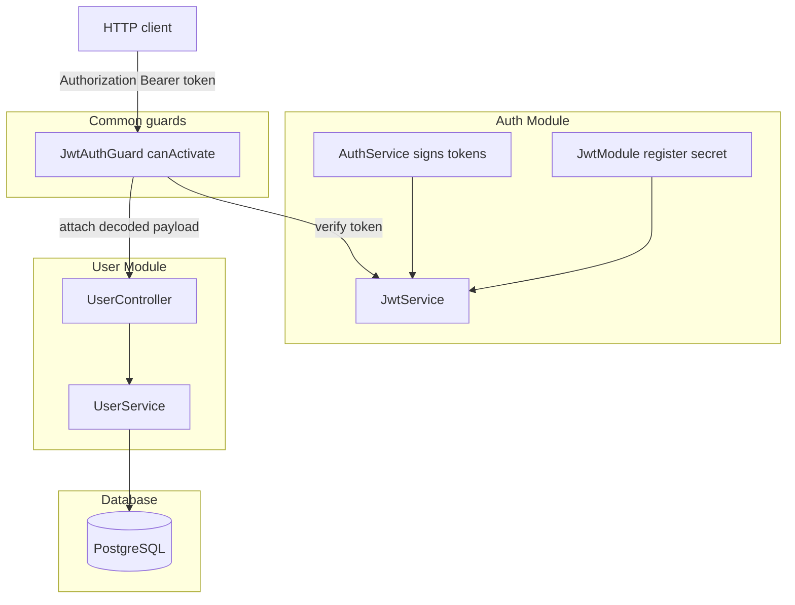
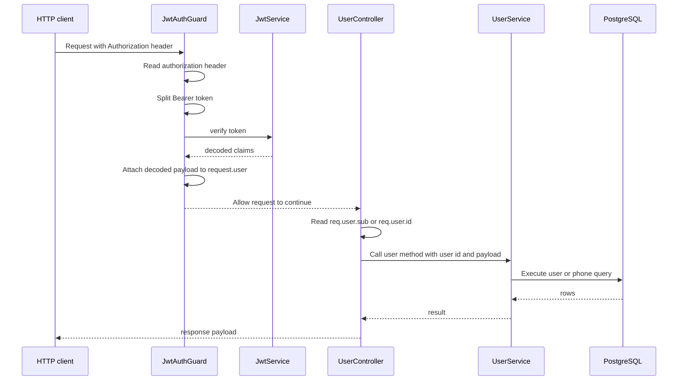

# Cross-cutting Authentication Context and Guard Behavior

## Overview

This section covers the runtime authentication boundary used by the protected user routes in `win-x88`. The key mechanism is `JwtAuthGuard`, which extracts a Bearer token from the incoming request, verifies it with `JwtService`, and places the decoded JWT claims onto `request.user` so downstream handlers can read the authenticated subject.

The protected user API is assembled in , which imports `AuthModule`, provides `JwtAuthGuard`, and exports it for reuse.  applies the guard at controller scope, so every route under `@Controller('user')` depends on a verified JWT before the handler runs.

## Architecture Overview



## Runtime Authentication Context

The protected request flow is driven by the decoded JWT payload rather than a separate session store. `JwtAuthGuard` does not transform the payload; it assigns the verified object directly to `request.user`, which means controller code must read the same claim names produced during token signing.

### JWT payload contract

| Claim | Produced by | Used by |
| --- | --- | --- |
| `sub` | `AuthService.login()`, `AuthService.adminLogin()`, `AuthService.refreshToken()` | `UserController.getProfile()`, `UserController.addPhoneNumber()`, `UserController.setPrimaryPhone()`, `UserController.deletePhone()`, `UserController.verifyPhone()` |
| `role` | `AuthService.login()`, `AuthService.adminLogin()` | Available on `request.user` after verification, but not read by the user controller methods in this section |


## Jwt Auth Guard

*File:* 

`JwtAuthGuard` is a custom guard that implements `canActivate()` directly. It reads `request.headers['authorization']`, enforces the `Bearer <token>` format, verifies the token with `JwtService`, and attaches the decoded result to `request.user`.

### Properties

| Property | Type | Description |
| --- | --- | --- |
| `jwtService` | `JwtService` | Verifies the bearer token and produces the decoded payload that is attached to `request.user` |


### Constructor Dependencies

| Type | Description |
| --- | --- |
| `JwtService` | Used to verify the access token extracted from the request header |


### Public Methods

| Method | Description |
| --- | --- |
| `canActivate` | Extracts the Bearer token, verifies it, stores the decoded payload on `request.user`, and allows the request to continue |


### Guard behavior

- Reads the `authorization` header directly from the HTTP request.
- Rejects requests with no header using `UnauthorizedException('No token provided')`.
- Rejects malformed headers where the second token segment is missing using `UnauthorizedException('Invalid token format')`.
- Verifies the token with `this.jwtService.verify(token)`.
- On success, assigns the decoded payload to `request.user`.
- On verification failure, throws `UnauthorizedException('Invalid or expired token')`.

## User Module Wiring

*File:* 

`UserModule` is the module boundary that makes the authenticated user routes operational. It imports `AuthModule` so the module graph includes the JWT provider registration, registers `JwtAuthGuard` in its providers, and exports the guard for reuse by other consumers.

### Properties

`UserModule` declares no instance properties.

### Module Dependencies

| Type | Description |
| --- | --- |
| `AuthModule` | Imported so the JWT provider registration is available in the module graph |
| `UserService` | Used by `UserController` for profile and phone-number operations |
| `JwtAuthGuard` | Registered as a provider and exported for protected user routes |


## User Controller Request Context

*File:* 

`UserController` applies `@UseGuards(JwtAuthGuard)` at class level, so every route beneath `@Controller('user')` is protected. Each handler reads authentication data from `req.user`, and the controller method decides whether to use `sub` or `id` from that object.

### Properties

| Property | Type | Description |
| --- | --- | --- |
| `userService` | `UserService` | Executes the profile and phone-management operations after the authenticated user id is resolved |


### Constructor Dependencies

| Type | Description |
| --- | --- |
| `UserService` | Provides the profile and phone management operations used by the guarded controller methods |


### Public Methods

| Method | Description |
| --- | --- |
| `getProfile` | Reads `req.user.sub`, loads the authenticated user profile, and returns the profile plus phone numbers |
| `updateProfile` | Reads `req.user.id`, forwards the update payload to `UserService.updateProfile()`, and returns a success wrapper |
| `addPhoneNumber` | Reads `req.user.sub`, adds a phone number from `dto.phoneNumber`, and returns the inserted row |
| `setPrimaryPhone` | Reads `req.user.sub`, converts `phoneId` to a number, and marks the phone as primary |
| `deletePhone` | Reads `req.user.sub`, converts `phoneId` to a number, and deletes the phone |
| `verifyPhone` | Reads `req.user.sub`, converts `phoneId` to a number, and marks the phone as verified |


### Request payload expectations

| Method | Auth data read from `req.user` | Body or path input expected by the handler |
| --- | --- | --- |
| `getProfile` | `sub` | No body; authenticated request only |
| `updateProfile` | `id` | Body with profile fields; the service reads `full_name`, `dob`, and `profile_image_url` |
| `addPhoneNumber` | `sub` | Body with `phoneNumber: string` |
| `setPrimaryPhone` | `sub` | Path param `phoneId` as a numeric string |
| `deletePhone` | `sub` | Path param `phoneId` as a numeric string |
| `verifyPhone` | `sub` | Path param `phoneId` as a numeric string |


## Protected User API

> **Note:** `JwtAuthGuard` attaches the decoded JWT payload to `request.user`, and the access tokens created in `AuthService.login()` and `AuthService.adminLogin()` carry `sub` and `role`. `UserController.updateProfile()` reads `req.user?.id` instead of `req.user?.sub`, so the authenticated user id is not passed through to `UserService.updateProfile()` correctly.

All endpoints in this section require an `Authorization: Bearer <token>` header because the `UserController` class is guarded by `JwtAuthGuard`.

#### Get User Profile

```api
{
    "title": "Get User Profile",
    "description": "Returns the authenticated user's profile and associated phone numbers after JwtAuthGuard verifies the Bearer token and populates request.user",
    "method": "GET",
    "baseUrl": "<ApiBaseUrl>",
    "endpoint": "/user/profile",
    "headers": [
        {
            "key": "Authorization",
            "value": "Bearer <token>",
            "required": true
        }
    ],
    "queryParams": [],
    "pathParams": [],
    "bodyType": "none",
    "requestBody": "",
    "formData": [],
    "rawBody": "",
    "responses": {
        "200": {
            "description": "Success",
            "body": "{\n    \"id\": 42,\n    \"user_code\": \"JOEDJOAB12\",\n    \"full_name\": \"Joe Doe\",\n    \"username\": \"jdoe123\",\n    \"email\": \"joe@example.com\",\n    \"dob\": \"1991-05-10\",\n    \"referral_code\": \"REF1234567\",\n    \"vip_level\": 1,\n    \"account_status\": \"ACTIVE\",\n    \"created_at\": \"2026-03-28T10:00:00.000Z\",\n    \"phones\": [\n        {\n            \"id\": 7,\n            \"phone_number\": \"9876543210\",\n            \"is_primary\": true,\n            \"is_verified\": false\n        }\n    ]\n}"
        }
    }
}
```

#### Update User Profile

```api
{
    "title": "Update User Profile",
    "description": "Updates the authenticated user's profile fields by reading the JWT context from request.user and forwarding the body to UserService.updateProfile",
    "method": "POST",
    "baseUrl": "<ApiBaseUrl>",
    "endpoint": "/user/update-profile",
    "headers": [
        {
            "key": "Authorization",
            "value": "Bearer <token>",
            "required": true
        }
    ],
    "queryParams": [],
    "pathParams": [],
    "bodyType": "json",
    "requestBody": "{\n    \"full_name\": \"Joe Doe\",\n    \"dob\": \"1991-05-10\",\n    \"profile_image_url\": \"https://cdn.example.com/profiles/joe-doe.png\"\n}",
    "formData": [],
    "rawBody": "",
    "responses": {
        "200": {
            "description": "Success",
            "body": "{\n    \"success\": true,\n    \"message\": \"Profile updated successfully\",\n    \"data\": {\n        \"message\": \"Profile updated successfully\"\n    }\n}"
        }
    }
}
```

#### Add Phone Number

```api
{
    "title": "Add Phone Number",
    "description": "Adds a phone number for the authenticated user after JwtAuthGuard places the verified payload on request.user and the controller reads request.user.sub",
    "method": "POST",
    "baseUrl": "<ApiBaseUrl>",
    "endpoint": "/user/add-phone",
    "headers": [
        {
            "key": "Authorization",
            "value": "Bearer <token>",
            "required": true
        }
    ],
    "queryParams": [],
    "pathParams": [],
    "bodyType": "json",
    "requestBody": "{\n    \"phoneNumber\": \"9876543210\"\n}",
    "formData": [],
    "rawBody": "",
    "responses": {
        "200": {
            "description": "Success",
            "body": "{\n    \"success\": true,\n    \"message\": \"Phone number added successfully\",\n    \"data\": {\n        \"id\": 7,\n        \"user_id\": 42,\n        \"phone_number\": \"9876543210\",\n        \"is_primary\": false,\n        \"is_verified\": false\n    }\n}"
        }
    }
}
```

#### Set Primary Phone

```api
{
    "title": "Set Primary Phone",
    "description": "Marks a phone number as primary for the authenticated user after the controller reads request.user.sub and converts the phoneId path parameter to a number",
    "method": "PATCH",
    "baseUrl": "<ApiBaseUrl>",
    "endpoint": "/user/phone/{phoneId}/primary",
    "headers": [
        {
            "key": "Authorization",
            "value": "Bearer <token>",
            "required": true
        }
    ],
    "queryParams": [],
    "pathParams": [
        {
            "name": "phoneId",
            "type": "string",
            "required": true,
            "description": "Phone row identifier converted to a number inside the controller"
        }
    ],
    "bodyType": "none",
    "requestBody": "",
    "formData": [],
    "rawBody": "",
    "responses": {
        "200": {
            "description": "Success",
            "body": "{\n    \"status\": \"success\",\n    \"code\": 200,\n    \"message\": \"Primary phone updated\"\n}"
        }
    }
}
```

#### Delete Phone

```api
{
    "title": "Delete Phone",
    "description": "Deletes a phone number for the authenticated user after the controller reads request.user.sub and converts the phoneId path parameter to a number",
    "method": "DELETE",
    "baseUrl": "<ApiBaseUrl>",
    "endpoint": "/user/phone/{phoneId}",
    "headers": [
        {
            "key": "Authorization",
            "value": "Bearer <token>",
            "required": true
        }
    ],
    "queryParams": [],
    "pathParams": [
        {
            "name": "phoneId",
            "type": "string",
            "required": true,
            "description": "Phone row identifier converted to a number inside the controller"
        }
    ],
    "bodyType": "none",
    "requestBody": "",
    "formData": [],
    "rawBody": "",
    "responses": {
        "200": {
            "description": "Success",
            "body": "{\n    \"status\": \"success\",\n    \"code\": 200,\n    \"message\": \"Phone deleted\"\n}"
        }
    }
}
```

#### Verify Phone

```api
{
    "title": "Verify Phone",
    "description": "Marks a phone number as verified for the authenticated user after the controller reads request.user.sub and converts the phoneId path parameter to a number",
    "method": "PATCH",
    "baseUrl": "<ApiBaseUrl>",
    "endpoint": "/user/phone/{phoneId}/verify",
    "headers": [
        {
            "key": "Authorization",
            "value": "Bearer <token>",
            "required": true
        }
    ],
    "queryParams": [],
    "pathParams": [
        {
            "name": "phoneId",
            "type": "string",
            "required": true,
            "description": "Phone row identifier converted to a number inside the controller"
        }
    ],
    "bodyType": "none",
    "requestBody": "",
    "formData": [],
    "rawBody": "",
    "responses": {
        "200": {
            "description": "Success",
            "body": "{\n    \"status\": \"success\",\n    \"code\": 200,\n    \"message\": \"Phone verified\"\n}"
        }
    }
}
```

## Request Flow



## Error Handling

### Guard-level failures

`JwtAuthGuard` throws `UnauthorizedException` before the handler executes when authentication is missing or invalid.

| Condition | Exception message |
| --- | --- |
| Missing `authorization` header | `No token provided` |
| Invalid Bearer format | `Invalid token format` |
| Verification failure or expired token | `Invalid or expired token` |


### Controller-level behavior

| Method | Behavior on failure |
| --- | --- |
| `getProfile` | Re-throws the error after the service call fails |
| `updateProfile` | Re-throws the error after the service call fails |
| `addPhoneNumber` | Re-throws the error after the service call fails |
| `setPrimaryPhone` | Returns a structured `{ status: 'error', code, message }` payload |
| `deletePhone` | Returns a structured `{ status: 'error', code, message }` payload |
| `verifyPhone` | Returns a structured `{ status: 'error', code, message }` payload |


## Dependencies

| Component | Dependency | Purpose |
| --- | --- | --- |
| `JwtAuthGuard` | `JwtService` | Verifies the bearer token and decodes the JWT payload |
| `UserModule` | `AuthModule` | Makes the JWT provider registration available to the module graph |
| `UserController` | `UserService` | Executes the user profile and phone operations after auth succeeds |
| `AuthModule` | `JwtModule.register({ secret: 'your-secret-key' })` | Supplies the JWT service used by the guard and token issuing code |


## Testing Considerations

The repository includes controller test scaffolds for `AuthController` and `UserController`, which instantiate those controllers directly. Those tests establish that the controller classes can be created in isolation, but the authenticated request path depends on `JwtAuthGuard`, `JwtService`, and the `request.user` payload contract described above.

## Key Classes Reference

| Class | Responsibility |
| --- | --- |
| `jwt-auth.guard.ts` | Verifies Bearer tokens and attaches the decoded payload to `request.user` |
| `user.module.ts` | Imports `AuthModule`, registers `JwtAuthGuard`, and exports it for protected user routes |
| `user.controller.ts` | Applies the guard to user routes and reads `request.user` claims to drive profile and phone actions |
| `auth.module.ts` | Registers and exports `JwtModule` so `JwtService` is available for verification |
| `auth.service.ts` | Signs access and refresh tokens whose claims are later consumed by `JwtAuthGuard` and the user controller |
