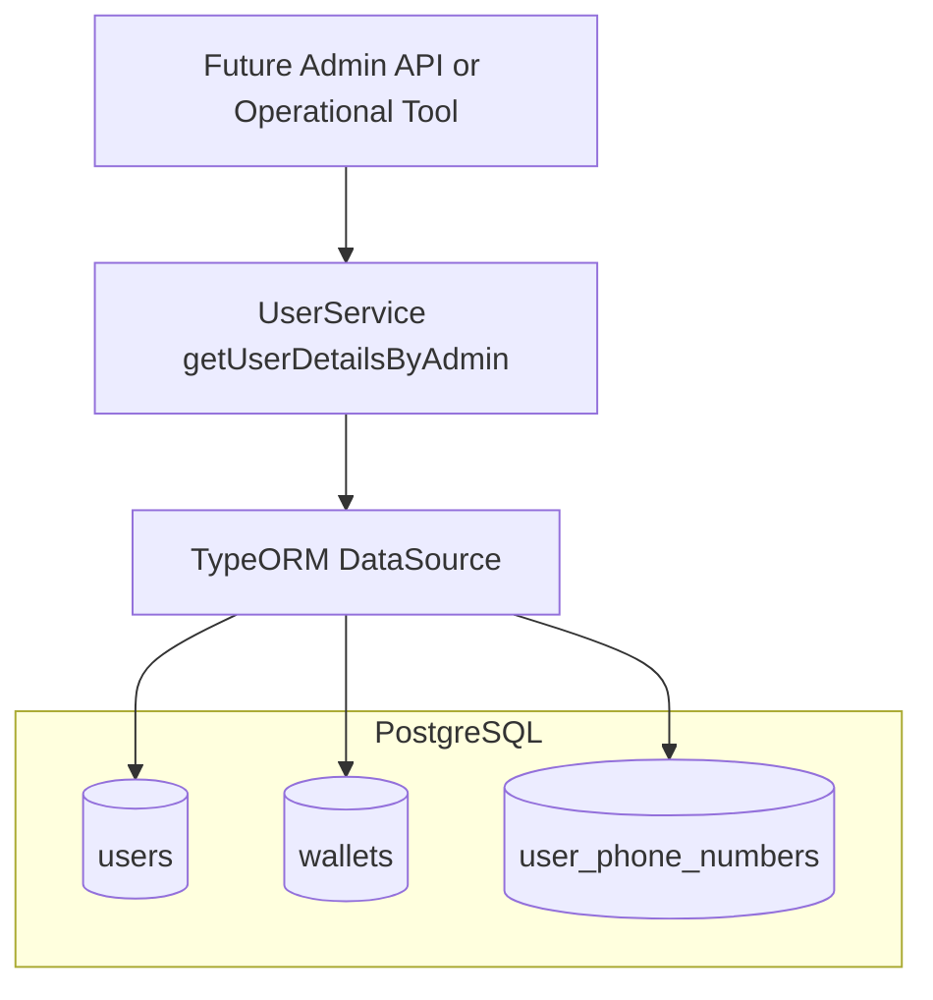
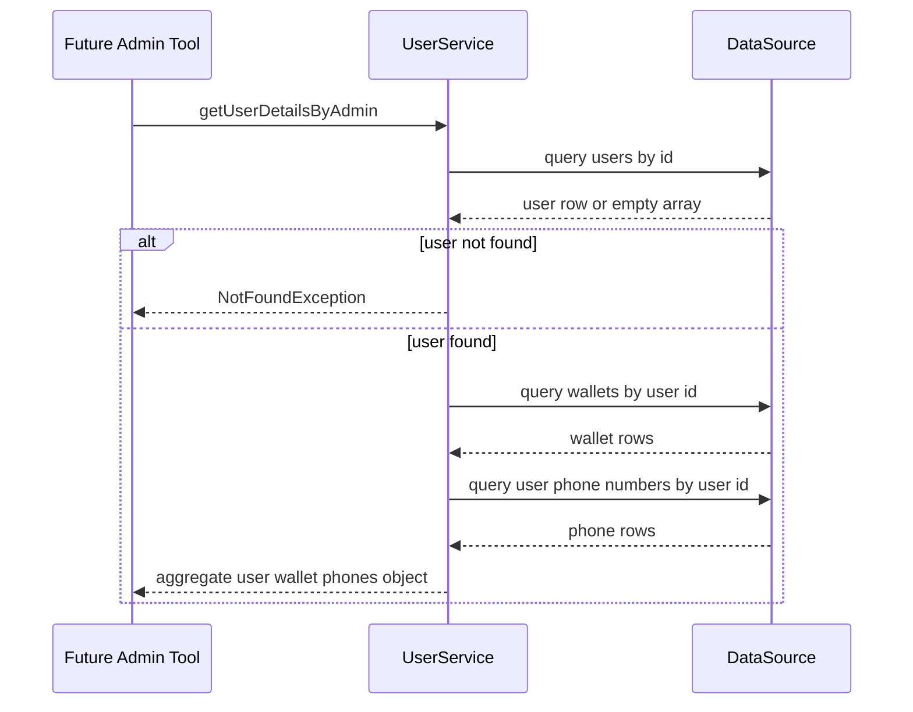

# User Management Domain - Admin-oriented User Detail Aggregation

## Overview

`getUserDetailsByAdmin` in  is an internal aggregation method for support and administrative use cases. It assembles a single user’s profile data together with the related wallet record and phone-number records, returning a composite object from three PostgreSQL tables: `users`, `wallets`, and `user_phone_numbers`.

This capability is service-level only. It is not exposed by a dedicated route in , which currently focuses on authenticated end-user profile and phone operations. That makes `getUserDetailsByAdmin` a reusable backend building block for future admin APIs, support consoles, or operational scripts that need a consolidated view of a user account.

## Architecture Overview

## Service-Level Capability

### `UserService`

*src/user/user.service.ts*

`UserService` is the only class in this section that contains the admin-oriented aggregation method. It uses injected `DataSource` access to query the database directly and returns assembled objects without any mapper, repository, or entity-level abstraction.

#### Properties

| Property | Type | Description |
| --- | --- | --- |
| `dataSource` | `DataSource` | TypeORM database access gateway used for raw SQL queries. |

#### Public Methods

| Method | Description |
| --- | --- |
| `getProfile` | Fetches the current user profile and associated phone records for authenticated user flows. |
| `updateProfile` | Updates selected profile fields for a user. |
| `addPhone` | Adds a phone number and assigns primary status when it is the first phone. |
| `setPrimaryPhone` | Marks one phone number as the primary phone for a user. |
| `deletePhone` | Deletes a user phone number with primary-phone protection rules. |
| `verifyPhone` | Marks a phone number as verified. |
| `getUserDetailsByAdmin` | Aggregates user, wallet, and phone data into a single admin-facing detail object. |

#### `getUserDetailsByAdmin`

This method performs a three-step read-only aggregation:

1. It queries `users` for a single row by `id`, selecting:- `id`
- `user_code`
- `full_name`
- `username`
- `email`
- `vip_level`
- `account_status`
2. If no row is returned, it throws `NotFoundException('User not found')`.
3. It then queries:- `wallets` with `SELECT * FROM wallets WHERE user_id = $1`
- `user_phone_numbers` with `SELECT phone_number, is_primary, is_verified FROM user_phone_numbers WHERE user_id = $1`

The method returns a merged object containing:

- the first user row,
- `wallet: wallet[0] || null`,
- `phones` as the full phone list.

##### Data coverage

| Source table | Columns selected | Output usage |
| --- | --- | --- |
| `users` | `id`, `user_code`, `full_name`, `username`, `email`, `vip_level`, `account_status` | Becomes the base object returned to the caller. |
| `wallets` | `*` | The first wallet row is attached as `wallet`. |
| `user_phone_numbers` | `phone_number`, `is_primary`, `is_verified` | Returned as the `phones` array. |

##### Returned aggregate shape

| Property | Type | Description |
| --- | --- | --- |
| `id` | `number` | User identifier from `users`. |
| `user_code` | `string` | User code from `users`. |
| `full_name` | `string` | User full name from `users`. |
| `username` | `string` | Username from `users`. |
| `email` | `string` | Email address from `users`. |
| `vip_level` | `number` | VIP level from `users`. |
| `account_status` | `string` | Account status from `users`. |
| `wallet` | `object \ | null` | First wallet row from `wallets`, or `null` when no wallet row exists. |
| `phones` | `Array<{ phone_number: string; is_primary: boolean; is_verified: boolean }>` | All phone-number rows for the user. |

##### Execution flow

## Integration Points

getUserDetailsByAdmin is not wired to a controller route in . The current controller exposes authenticated profile and phone operations only, so this aggregate is available to in-process callers until an admin-specific API or tool invokes it.

- `DataSource` from TypeORM, used directly for SQL execution.
- PostgreSQL tables:- `users`
- `wallets`
- `user_phone_numbers`
- Future admin-facing API handlers or operational tooling that need a single user detail payload.

## Error Handling

`getUserDetailsByAdmin` converts a missing user into `NotFoundException('User not found')`. After that check, the method does not wrap the wallet or phone queries in a separate try/catch block, so database-level failures bubble to the caller.

The method also treats related data asymmetrically:

- missing wallet rows become `wallet: null`
- missing phone rows become `phones: []`

## Testing Considerations

The method’s observable behaviors are driven by the SQL results:

- a missing `users` row raises `NotFoundException`
- an existing user with no wallet returns `wallet: null`
- an existing user with no phones returns an empty `phones` array
- the returned user object contains only the selected user columns plus the two derived fields

## Key Classes Reference

| Class | Responsibility |
| --- | --- |
| `user.service.ts` | Hosts `getUserDetailsByAdmin` and assembles the user, wallet, and phone aggregate from PostgreSQL. |
| `user.controller.ts` | Exposes authenticated user profile and phone management routes; does not expose `getUserDetailsByAdmin`. |
