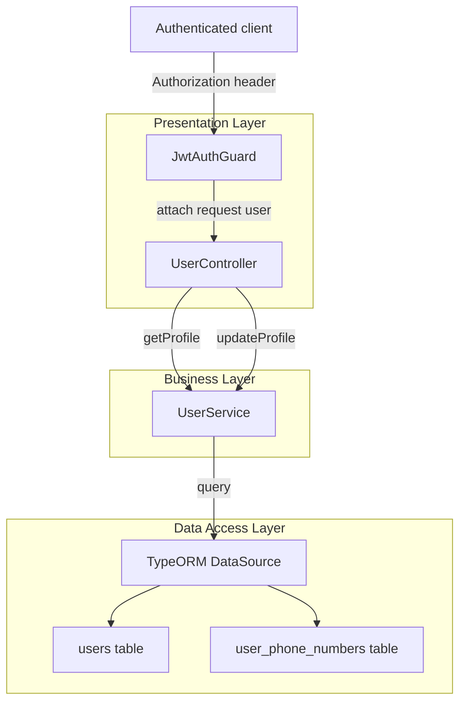
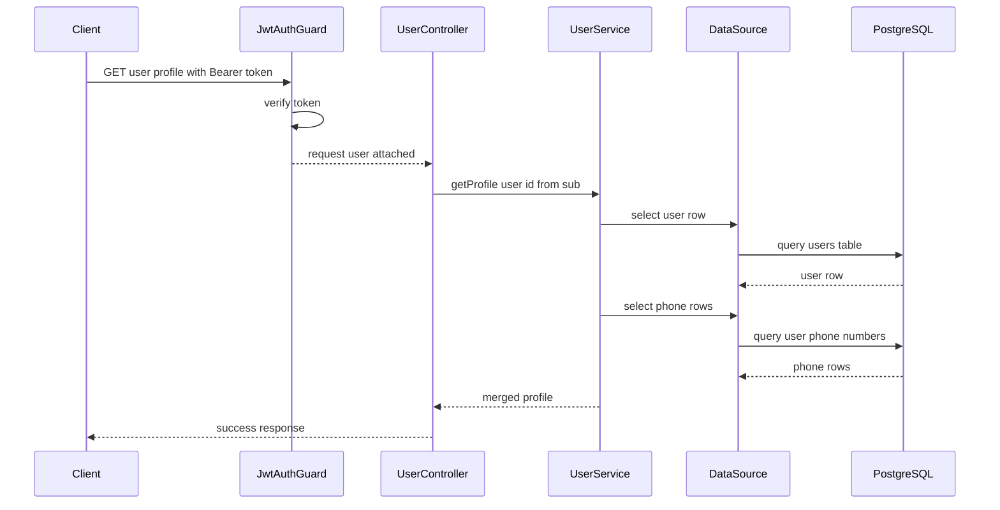
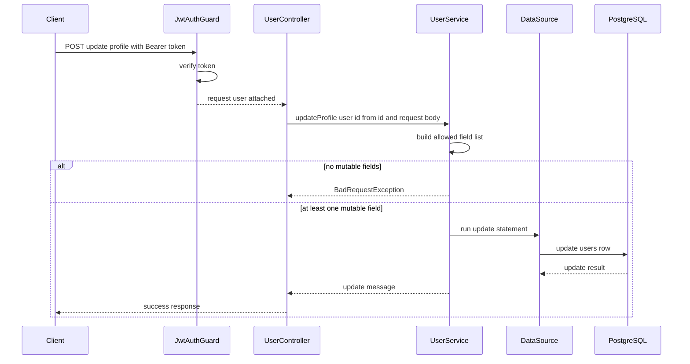

# User Management DOMAIN - Authenticated profile retrieval and update flow

## Overview

This part of the User domain lets an authenticated user fetch their own profile and update a limited set of mutable profile fields. The controller is protected at class level with `JwtAuthGuard`, so both endpoints rely on a verified JWT before any service logic runs.

The profile retrieval flow composes data from `users` and `user_phone_numbers` into one response object. The update flow only accepts `full_name`, `dob`, and `profile_image_url`, and it builds the `UPDATE` statement dynamically so only provided, allowed fields are written back to PostgreSQL.

## Architecture Overview



## Protected Endpoints

### JWT Authentication Guard

`JwtAuthGuard` is applied with `@UseGuards(JwtAuthGuard)` on `UserController`, so every route in this controller requires a valid `Authorization` header. The guard reads the bearer token, verifies it with `JwtService`, and assigns the decoded payload to `request.user`.

The decoded token shape matters downstream. The login flow signs access tokens with `{ sub, role }`, so the authenticated user identity available to controller methods is `request.user.sub`, not `request.user.id`.

#### `JwtAuthGuard` Properties

| Property | Type | Description |
| --- | --- | --- |
| `jwtService` | `JwtService` | Verifies the bearer token and returns the decoded JWT payload |


#### `JwtAuthGuard` Public Methods

| Method | Description |
| --- | --- |
| `canActivate` | Reads the `authorization` header, verifies the JWT, and attaches the decoded payload to `request.user` |


### Get Authenticated User Profile

#### Get Authenticated User Profile

```api
{
    "title": "Get Authenticated User Profile",
    "description": "Retrieves the authenticated user's profile and attached phone numbers from the protected User controller",
    "method": "GET",
    "baseUrl": "<ApiBaseUrl>",
    "endpoint": "/user/profile",
    "headers": [
        {
            "key": "Authorization",
            "value": "Bearer <token>",
            "required": true
        }
    ],
    "queryParams": [],
    "pathParams": [],
    "bodyType": "none",
    "requestBody": "",
    "formData": [],
    "rawBody": "",
    "responses": {
        "200": {
            "description": "Success",
            "body": "{\n    \"success\": true,\n    \"message\": \"User profile retrieved successfully\",\n    \"data\": {\n        \"id\": 12,\n        \"user_code\": \"JDJOH1A2B\",\n        \"full_name\": \"John Doe\",\n        \"username\": \"jdoe123\",\n        \"email\": \"john.doe@example.com\",\n        \"dob\": \"1992-04-17\",\n        \"referral_code\": \"REF12345\",\n        \"vip_level\": 2,\n        \"account_status\": \"ACTIVE\",\n        \"created_at\": \"2026-03-28T10:15:30.000Z\",\n        \"phones\": [\n            {\n                \"id\": 44,\n                \"phone_number\": \"9876543210\",\n                \"is_primary\": true,\n                \"is_verified\": true\n            }\n        ]\n    }\n}"
        }
    }
}
```

### Update Authenticated User Profile

#### Update Authenticated User Profile

```api
{
    "title": "Update Authenticated User Profile",
    "description": "Updates the authenticated user's allowed profile fields through a dynamic SQL update",
    "method": "POST",
    "baseUrl": "<ApiBaseUrl>",
    "endpoint": "/user/update-profile",
    "headers": [
        {
            "key": "Authorization",
            "value": "Bearer <token>",
            "required": true
        },
        {
            "key": "Content-Type",
            "value": "application/json",
            "required": true
        }
    ],
    "queryParams": [],
    "pathParams": [],
    "bodyType": "json",
    "requestBody": "{\n    \"full_name\": \"John Doe\",\n    \"dob\": \"1992-04-17\",\n    \"profile_image_url\": \"https://cdn.example.com/profiles/john-doe.png\"\n}",
    "formData": [],
    "rawBody": "",
    "responses": {
        "200": {
            "description": "Success",
            "body": "{\n    \"success\": true,\n    \"message\": \"Profile updated successfully\",\n    \"data\": {\n        \"message\": \"Profile updated successfully\"\n    }\n}"
        }
    }
}
```

## Component Structure

### `UserController`

getProfile and updateProfile do not use the same authenticated identity field. getProfile reads req.user?.sub, while updateProfile reads req.user?.id. Because JwtAuthGuard attaches the decoded JWT payload and the login flow signs sub rather than id, updateProfile receives an undefined userId unless the token payload is shaped differently upstream.

*File: `src/user/user.controller.ts`*

`UserController` exposes the authenticated profile retrieval and update endpoints. The controller is protected by `JwtAuthGuard` at the class level and forwards identity plus request payloads to `UserService`.

#### Properties

| Property | Type | Description |
| --- | --- | --- |
| `userService` | `UserService` | Handles profile retrieval and profile update persistence |


#### Public Methods

| Method | Description |
| --- | --- |
| `getProfile` | Reads the authenticated user id from `request.user.sub` and returns the merged profile response |
| `updateProfile` | Reads the authenticated user id from `request.user.id` and forwards editable profile fields to `UserService` |


#### Method Behavior

- `getProfile`- Reads `req.user?.sub`
- Calls `userService.getProfile(userId)`
- Returns `{ success, message, data }`
- Re-throws errors without reshaping them

- `updateProfile`- Reads `req.user?.id`
- Calls `userService.updateProfile(userId, dto)`
- Returns `{ success, message, data }`
- Re-throws errors without reshaping them

### `UserService`

*File: `src/user/user.service.ts`*

`UserService` performs the profile read and profile update work directly against PostgreSQL through `DataSource.query`. The profile retrieval path queries `users` and `user_phone_numbers` separately, then merges them into one response object.

#### Properties

| Property | Type | Description |
| --- | --- | --- |
| `dataSource` | `DataSource` | Executes raw SQL queries and query runner operations against PostgreSQL |


#### Public Methods

| Method | Description |
| --- | --- |
| `getProfile` | Loads the core user row and associated phone rows, then returns a combined profile object |
| `updateProfile` | Builds a dynamic `UPDATE` statement for mutable profile fields and updates `updated_at` |


#### `getProfile`

- Reads from `users` using the supplied `userId`
- Throws `NotFoundException('User not found')` when no user row is returned
- Reads phone rows from `user_phone_numbers` using the same `userId`
- Returns a merged object of:- the first `users` row
- `phones`, containing all matching phone rows

#### `updateProfile`

The profile assembly is a logical merge in application code, not a SQL JOIN. UserService.getProfile executes two separate queries and combines their results in the returned object.

- Starts with empty `fields` and `values` arrays
- Adds only these mutable fields when they are truthy in `dto`:- `full_name`
- `dob`
- `profile_image_url`
- Throws `BadRequestException('Nothing to update')` when none of the allowed fields are present
- Appends `userId` as the final SQL parameter
- Executes:- `UPDATE users SET ... , updated_at = NOW() WHERE id = $n`
- Returns `{ message: 'Profile updated successfully' }`

#### Allowed Mutable Fields

| Field | Type | Used In SQL |
| --- | --- | --- |
| `full_name` | `string` | `SET full_name = $n` |
| `dob` | `string` | `SET dob = $n` |
| `profile_image_url` | `string` | `SET profile_image_url = $n` |


### PostgreSQL Access via `DataSource`

`UserService` uses the TypeORM `DataSource` directly rather than repository abstractions. The profile retrieval path uses plain SQL `SELECT` statements, and the update path uses a dynamically constructed `UPDATE` statement with positional parameters.

| Used API | Where It Appears | Purpose |
| --- | --- | --- |
| `query` | `getProfile`, `updateProfile` | Executes raw SQL for `SELECT` and `UPDATE` operations |
| `createQueryRunner` | Not used in the profile retrieval or update methods | Present in the wider `UserService` file for other user workflows |


## Feature Flows

### Profile Retrieval Flow



1. The request enters `JwtAuthGuard`.
2. The guard verifies the bearer token and attaches the decoded payload to `request.user`.
3. `UserController.getProfile` reads `req.user?.sub`.
4. `UserService.getProfile` fetches the user row from `users`.
5. The service fetches all rows from `user_phone_numbers` for the same user.
6. The service returns the merged object, and the controller wraps it in the success envelope.

### Profile Update Flow



1. The request enters `JwtAuthGuard` and must include `Authorization: Bearer <token>`.
2. The guard attaches the decoded payload to `request.user`.
3. `UserController.updateProfile` reads `req.user?.id`.
4. `UserService.updateProfile` keeps only the allowed mutable fields.
5. If none are present, the service throws `BadRequestException('Nothing to update')`.
6. Otherwise, the service executes a parameterized `UPDATE` statement and refreshes `updated_at`.
7. The controller returns a success envelope with the update message.

## Data Shapes

### Authenticated Profile Response Data

| Property | Type | Description |
| --- | --- | --- |
| `id` | `number` | User primary key |
| `user_code` | `string` | User code stored in `users` |
| `full_name` | `string` | User full name |
| `username` | `string` | Username |
| `email` | `string` | Email address |
| `dob` | `string` | Date of birth value returned from PostgreSQL |
| `referral_code` | `string` | Referral code |
| `vip_level` | `number` | VIP tier |
| `account_status` | `string` | Account state such as `ACTIVE` |
| `created_at` | `string` | Creation timestamp |
| `phones` | `PhoneNumber[]` | Phone rows from `user_phone_numbers` |


### Phone Number Response Item

| Property | Type | Description |
| --- | --- | --- |
| `id` | `number` | Phone row id |
| `phone_number` | `string` | Stored phone number |
| `is_primary` | `boolean` | Primary phone marker |
| `is_verified` | `boolean` | Verification marker |


### Update Profile Request Body

| Property | Type | Description |
| --- | --- | --- |
| `full_name` | `string` | Optional mutable field |
| `dob` | `string` | Optional mutable field |
| `profile_image_url` | `string` | Optional mutable field |


### Controller Response Envelope

| Property | Type | Description |
| --- | --- | --- |
| `success` | `boolean` | Indicates a successful controller response |
| `message` | `string` | Human-readable message |
| `data` | `object` | Payload returned by the service |


## Error Handling

| Source | Condition | Exception |
| --- | --- | --- |
| `JwtAuthGuard.canActivate` | Missing `authorization` header | `UnauthorizedException('No token provided')` |
| `JwtAuthGuard.canActivate` | Missing bearer token segment | `UnauthorizedException('Invalid token format')` |
| `JwtAuthGuard.canActivate` | Token verification fails | `UnauthorizedException('Invalid or expired token')` |
| `UserService.getProfile` | No matching user row | `NotFoundException('User not found')` |
| `UserService.updateProfile` | No allowed mutable fields in request body | `BadRequestException('Nothing to update')` |
| `UserController` methods | Downstream service throws | Rethrows the original error |


The controller methods do not normalize errors into a custom error envelope. They pass exceptions through unchanged, so the runtime response depends on the thrown Nest exception or the global exception handling pipeline.

## Dependencies and Integration Points

- `JwtAuthGuard` depends on `JwtService` from `@nestjs/jwt`
- `UserService` depends on `DataSource` from TypeORM
- `UserModule` imports `AuthModule`, which exposes the JWT infrastructure needed by `JwtAuthGuard`
- PostgreSQL tables used by this flow:- `users`
- `user_phone_numbers`
- The authenticated user identifier comes from the JWT payload attached to `request.user`

## Key Classes Reference

| Class | Responsibility |
| --- | --- |
| `user.controller.ts` | Exposes authenticated profile retrieval and profile update endpoints |
| `user.service.ts` | Loads and updates user profile data through raw SQL queries |
| `jwt-auth.guard.ts` | Verifies bearer tokens and attaches the decoded payload to `request.user` |
