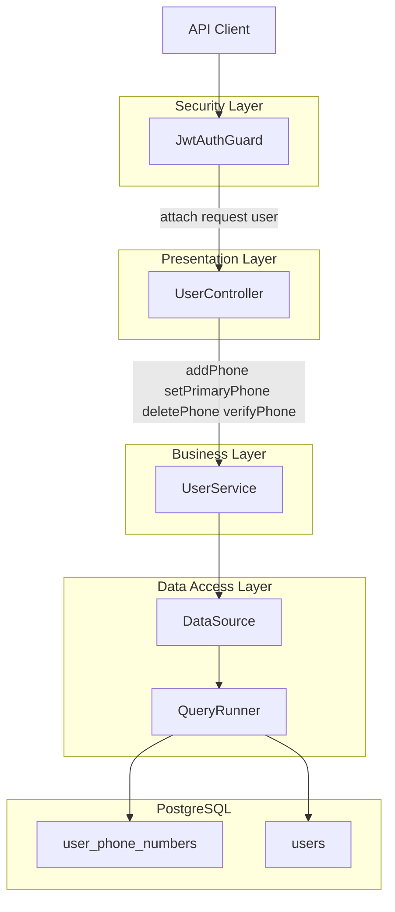
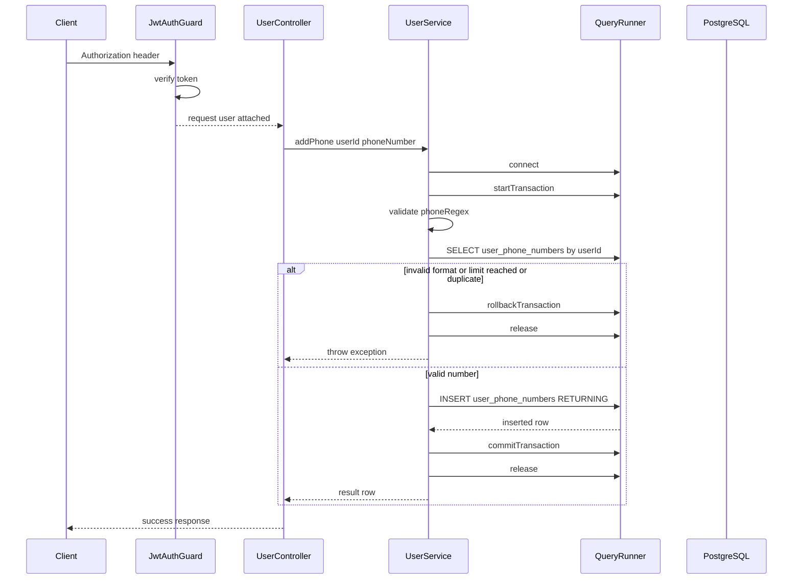
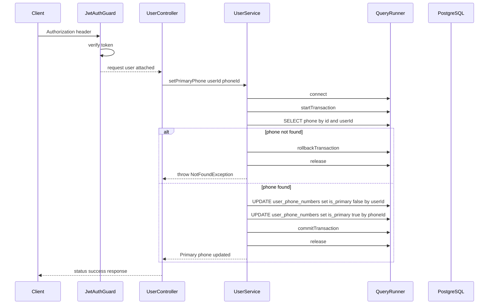
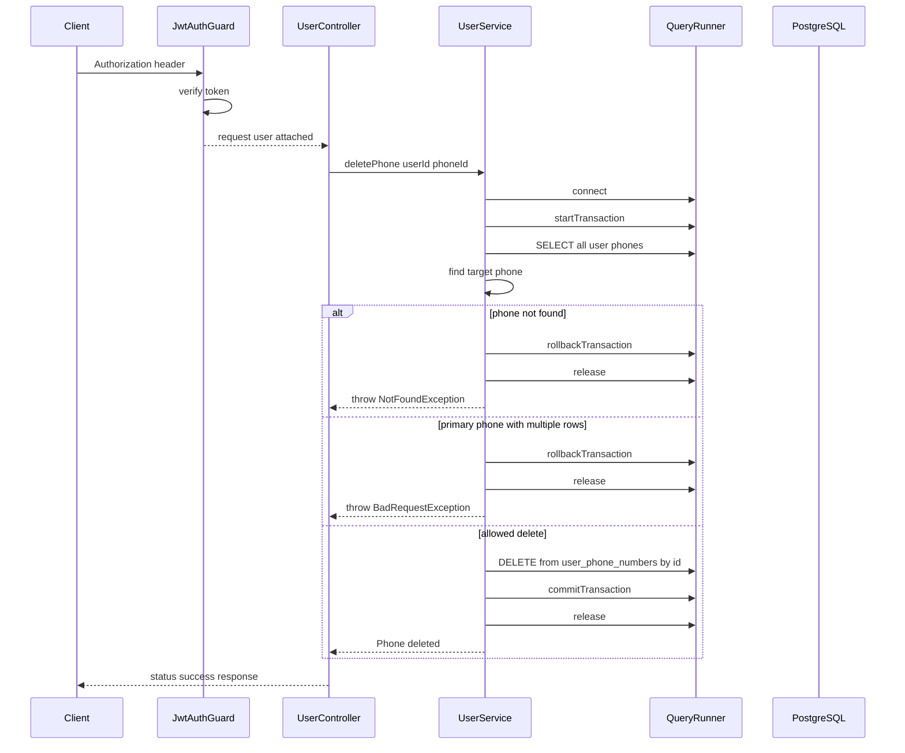
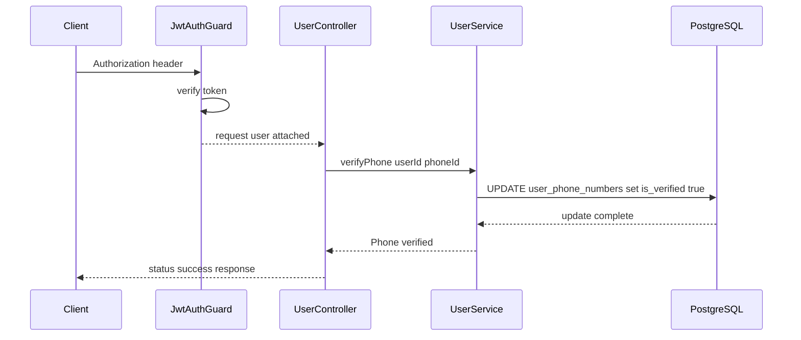
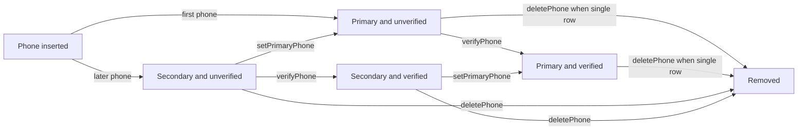

# User Management Domain - Phone Number Lifecycle Management and Transactional Rules

## Overview

This feature lets an authenticated user manage the `user_phone_numbers` records attached to their account. The flow is centered on four actions exposed by : add a phone number, make one number primary, delete a number, and mark a number as verified.

The implementation in  applies the feature rules directly in raw SQL through TypeORM `DataSource` and `QueryRunner`. Phone creation runs inside a transaction, primary reassignment is atomic, deletion is guarded when the number is primary and other numbers exist, and verification uses a direct update path.

A class-level `JwtAuthGuard` protects the controller. Every handler reads the authenticated user from `req.user.sub` and passes that user id into the service layer before any phone lifecycle rule is applied.

## Architecture Overview



## Security Gate

### JWT Auth Guard

*`src/common/guards/jwt-auth.guard.ts`*

`JwtAuthGuard` is applied at the `UserController` class level with `@UseGuards(JwtAuthGuard)`, so the four phone endpoints are only reached after Bearer token verification succeeds. It reads `request.headers['authorization']`, splits the token from the `Bearer` prefix, verifies the JWT, and attaches the decoded payload to `request.user`.

#### Properties

| Property | Type | Description |
| --- | --- | --- |
| `jwtService` | `JwtService` | Verifies the incoming JWT and populates `request.user` when validation succeeds. |


#### Constructor Dependencies

| Type | Description |
| --- | --- |
| `JwtService` | Used to verify the access token from the `authorization` header. |


#### Public Methods

| Method | Description |
| --- | --- |
| `canActivate` | Validates the Bearer token, attaches the decoded payload to `request.user`, and blocks the request with `UnauthorizedException` when the token is missing, malformed, invalid, or expired. |


## User Controller

*`src/user/user.controller.ts`*

`UserController` is mounted at `/user` and protected by `JwtAuthGuard`. The phone-related handlers read `req.user.sub`, convert `phoneId` path parameters to numbers, and delegate all business rules to `UserService`.

#### Properties

| Property | Type | Description |
| --- | --- | --- |
| `userService` | `UserService` | Handles phone lifecycle validation, transactions, and SQL execution. |


#### Constructor Dependencies

| Type | Description |
| --- | --- |
| `UserService` | Executes the phone management rules and persistence operations. |


#### Public Methods

| Method | Description |
| --- | --- |
| `addPhoneNumber` | Accepts a body with `phoneNumber`, resolves the authenticated user id from `req.user.sub`, and forwards the request to `UserService.addPhone`. |
| `setPrimaryPhone` | Reads `phoneId` from the route, validates that `req.user.sub` exists, and forwards the request to `UserService.setPrimaryPhone`. |
| `deletePhone` | Reads `phoneId` from the route, validates that `req.user.sub` exists, and forwards the request to `UserService.deletePhone`. |
| `verifyPhone` | Reads `phoneId` from the route, validates that `req.user.sub` exists, and forwards the request to `UserService.verifyPhone`. |


### Add Phone Number

#### Add Phone Number

```api
{
    "title": "Add Phone Number",
    "description": "Adds a phone number for the authenticated user, validates the 10-digit format, enforces the maximum-three-phone rule, rejects duplicates, and marks the first inserted number as primary.",
    "method": "POST",
    "baseUrl": "<UserApiBaseUrl>",
    "endpoint": "/user/add-phone",
    "headers": [
        {
            "key": "Authorization",
            "value": "Bearer <token>",
            "required": true
        },
        {
            "key": "Content-Type",
            "value": "application/json",
            "required": true
        }
    ],
    "queryParams": [],
    "pathParams": [],
    "bodyType": "json",
    "requestBody": "{\n    \"phoneNumber\": \"9876543210\"\n}",
    "formData": [],
    "rawBody": "",
    "responses": {
        "201": {
            "description": "Phone number added successfully",
            "body": "{\n    \"success\": true,\n    \"message\": \"Phone number added successfully\",\n    \"data\": {\n        \"id\": 18,\n        \"user_id\": 42,\n        \"phone_number\": \"9876543210\",\n        \"is_primary\": true,\n        \"is_verified\": false\n    }\n}"
        }
    }
}
```

The handler itself does not apply validation rules. It forwards `dto.phoneNumber` to `UserService.addPhone`, where the regex, capacity limit, duplicate check, and transaction handling are enforced.

### Set Primary Phone

#### Set Primary Phone

```api
{
    "title": "Set Primary Phone",
    "description": "Sets the specified phone row as the primary number for the authenticated user and performs the reassignment inside a transaction.",
    "method": "PATCH",
    "baseUrl": "<UserApiBaseUrl>",
    "endpoint": "/user/phone/:phoneId/primary",
    "headers": [
        {
            "key": "Authorization",
            "value": "Bearer <token>",
            "required": true
        },
        {
            "key": "Content-Type",
            "value": "application/json",
            "required": true
        }
    ],
    "queryParams": [],
    "pathParams": [
        {
            "key": "phoneId",
            "value": "18",
            "required": true
        }
    ],
    "bodyType": "json",
    "requestBody": "[]",
    "formData": [],
    "rawBody": "",
    "responses": {
        "200": {
            "description": "Primary phone updated",
            "body": "{\n    \"status\": \"success\",\n    \"code\": 200,\n    \"message\": \"Primary phone updated\"\n}"
        }
    }
}
```

The controller converts `phoneId` to `Number(phoneId)` and returns an error wrapper when the service throws. The service first checks ownership, then clears the primary flag across all of the user’s phone rows, then marks the target row as primary in the same transaction.

### Delete Phone Number

#### Delete Phone Number

```api
{
    "title": "Delete Phone Number",
    "description": "Deletes a user phone row after verifying ownership and applying the primary-number deletion restriction inside a transaction.",
    "method": "DELETE",
    "baseUrl": "<UserApiBaseUrl>",
    "endpoint": "/user/phone/:phoneId",
    "headers": [
        {
            "key": "Authorization",
            "value": "Bearer <token>",
            "required": true
        }
    ],
    "queryParams": [],
    "pathParams": [
        {
            "key": "phoneId",
            "value": "18",
            "required": true
        }
    ],
    "bodyType": "none",
    "requestBody": "",
    "formData": [],
    "rawBody": "",
    "responses": {
        "200": {
            "description": "Phone deleted",
            "body": "{\n    \"status\": \"success\",\n    \"code\": 200,\n    \"message\": \"Phone deleted\"\n}"
        }
    }
}
```

The controller also converts `phoneId` to `Number(phoneId)` before calling the service. The service prevents deleting a primary phone when the user still has more than one phone number, which forces the caller to reassign primary status before removal.

### Verify Phone Number

#### Verify Phone Number

```api
{
    "title": "Verify Phone Number",
    "description": "Marks the specified phone row as verified for the authenticated user and returns a success message after a direct update.",
    "method": "PATCH",
    "baseUrl": "<UserApiBaseUrl>",
    "endpoint": "/user/phone/:phoneId/verify",
    "headers": [
        {
            "key": "Authorization",
            "value": "Bearer <token>",
            "required": true
        },
        {
            "key": "Content-Type",
            "value": "application/json",
            "required": true
        }
    ],
    "queryParams": [],
    "pathParams": [
        {
            "key": "phoneId",
            "value": "18",
            "required": true
        }
    ],
    "bodyType": "json",
    "requestBody": "[]",
    "formData": [],
    "rawBody": "",
    "responses": {
        "200": {
            "description": "Phone verified",
            "body": "{\n    \"status\": \"success\",\n    \"code\": 200,\n    \"message\": \"Phone verified\"\n}"
        }
    }
}
```

## User Service

verifyPhone issues a direct UPDATE and returns Phone verified without checking the affected row count. The controller always returns the success wrapper when the service call completes, even if the update matched no rows.

*`src/user/user.service.ts`*

`UserService` contains the full phone lifecycle logic. It uses `DataSource.createQueryRunner()` for transactional operations and raw `dataSource.query()` for the direct verification update path.

#### Properties

| Property | Type | Description |
| --- | --- | --- |
| `dataSource` | `DataSource` | Executes the raw SQL statements and creates `QueryRunner` instances for transactional changes. |


#### Constructor Dependencies

| Type | Description |
| --- | --- |
| `DataSource` | Provides direct access to the PostgreSQL connection used by the phone lifecycle methods. |


#### Public Methods

| Method | Description |
| --- | --- |
| `addPhone` | Validates the number format, enforces the three-phone cap, rejects duplicates, sets the first phone as primary, inserts the row, and commits or रोलs back the transaction. |
| `setPrimaryPhone` | Verifies that the phone belongs to the user, clears the current primary flag from all user phone rows, sets the selected row as primary, and commits atomically. |
| `deletePhone` | Verifies ownership, blocks deletion of a primary phone when more than one phone exists, deletes the target row, and commits or rolls back the transaction. |
| `verifyPhone` | Updates `is_verified` to `true` for the matching `phoneId` and `userId` using a direct SQL update. |


### Phone Lifecycle Rules

| Rule | Implementation |
| --- | --- |
| 10-digit format validation | `addPhone` uses `^[6-9]\d{9}$` and rejects numbers that do not match the pattern. |
| Maximum three phones | `addPhone` queries all user phone rows and rejects the insert when the user already has three rows. |
| Duplicate detection | `addPhone` checks the fetched phone list with `find(p => p.phone_number === phoneNumber)`. |
| First phone becomes primary | `addPhone` sets `isPrimary` to `true` when `phones.length === 0`. |
| Primary reassignment | `setPrimaryPhone` updates all user phone rows to `is_primary = false`, then updates the selected row to `is_primary = true` in the same transaction. |
| Deletion restriction | `deletePhone` blocks deletion when the target row is primary and the user has more than one phone row. |
| Verification path | `verifyPhone` performs a direct `UPDATE` with no transaction wrapper. |


## Feature Flows

### Add Phone Number Flow



### Set Primary Phone Flow



### Delete Phone Flow



### Verify Phone Flow



## State Management

The feature stores phone lifecycle state directly in `user_phone_numbers` with boolean flags. The primary state is controlled by `is_primary`, and verification state is controlled by `is_verified`.



## Error Handling

| Location | Trigger | Exception or Response | Effect |
| --- | --- | --- | --- |
| `JwtAuthGuard.canActivate` | Missing `authorization` header | `UnauthorizedException('No token provided')` | Request is blocked before the controller runs. |
| `JwtAuthGuard.canActivate` | Missing Bearer token value | `UnauthorizedException('Invalid token format')` | Request is blocked before the controller runs. |
| `JwtAuthGuard.canActivate` | JWT verification failure | `UnauthorizedException('Invalid or expired token')` | Request is blocked before the controller runs. |
| `UserService.addPhone` | Phone does not match the regex | `BadRequestException('Invalid phone number format')` | Transaction is rolled back. |
| `UserService.addPhone` | User already has three numbers | `BadRequestException('Maximum 3 phone numbers allowed')` | Transaction is rolled back. |
| `UserService.addPhone` | Duplicate phone number in the user list | `BadRequestException('Phone already exists')` | Transaction is rolled back. |
| `UserService.addPhone` | Unique constraint violation | `BadRequestException('Phone number already exists')` | Transaction is rolled back. |
| `UserService.setPrimaryPhone` | Target phone does not belong to user | `NotFoundException('Phone not found')` | Transaction is rolled back. |
| `UserService.deletePhone` | Target phone does not belong to user | `NotFoundException('Phone not found')` | Transaction is rolled back. |
| `UserService.deletePhone` | Primary phone deletion with more than one phone | `BadRequestException('Set another phone as primary before deleting')` | Transaction is rolled back. |
| `UserController.setPrimaryPhone` | Missing `req.user.sub` | `BadRequestException('User not authenticated')` | Controller returns an error wrapper. |
| `UserController.deletePhone` | Missing `req.user.sub` | `BadRequestException('User not authenticated')` | Controller returns an error wrapper. |
| `UserController.verifyPhone` | Missing `req.user.sub` | `BadRequestException('User not authenticated')` | Controller returns an error wrapper. |
| `UserService.verifyPhone` | No matching row | No exception in code path | The handler still returns `Phone verified` if the update call completes. |


The controller uses two response styles. `addPhoneNumber` rethrows service errors, while `setPrimaryPhone`, `deletePhone`, and `verifyPhone` catch errors and return `{ status: 'error', code, message }`.

## Dependencies

- `@nestjs/common` for `Controller`, `UseGuards`, and the exception types used by the phone lifecycle methods.
-  for the class-level authentication gate.
- `@nestjs/jwt` through `JwtAuthGuard` and the `AuthModule` export chain.
- `typeorm` `DataSource` and `QueryRunner` for raw SQL and transaction control.
- PostgreSQL tables `users` and `user_phone_numbers`.
- `UserModule` imports `AuthModule`, which makes the JWT provider available to the guard.

## Testing Considerations

- Rejects requests without a Bearer token before any controller method runs.
- Accepts only numbers that match `^[6-9]\d{9}$` in `addPhone`.
- Rejects a fourth phone for the same user.
- Rejects duplicate phone numbers for the same user.
- Marks the first inserted phone as primary.
- Reassigns primary status atomically when `setPrimaryPhone` runs.
- Blocks deletion of a primary number when the user still has more than one phone.
- Returns the verification success wrapper after the direct update path completes.

## Key Classes Reference

| Class | Responsibility |
| --- | --- |
| `user.controller.ts` | Exposes authenticated phone lifecycle endpoints and shapes the controller responses. |
| `user.service.ts` | Enforces phone validation, primary selection, deletion rules, verification updates, and transaction handling. |
| `jwt-auth.guard.ts` | Verifies the JWT from the `authorization` header and populates `request.user`. |
